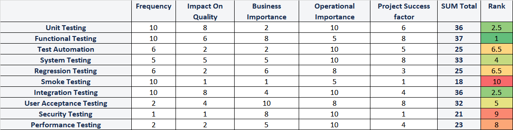
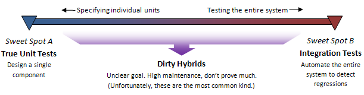
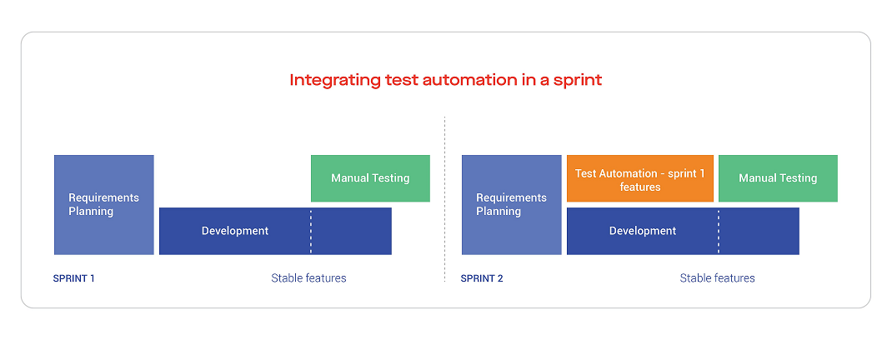
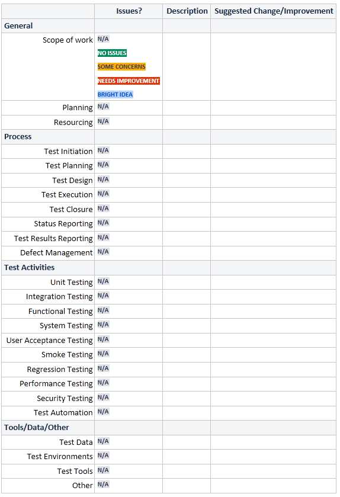

<!-- vscode-markdown-toc -->
* [Introduction](#Introduction)
* [Content](#Content)
* [Key Scope Statements](#KeyScopeStatements)
* [Risks, Dependencies, Assumptions and Constraints](#RisksDependenciesAssumptionsandConstraints)
	* [Dependencies](#Dependencies)
	* [Assumptions](#Assumptions)
	* [Constraints](#Constraints)
* [Test Process Introduction](#TestProcessIntroduction)
	* [Testing Pyramid](#TestingPyramid)
		* [First Layer](#FirstLayer)
		* [Second Layer](#SecondLayer)
		* [Third layer](#Thirdlayer)
* [Test Processes](#TestProcesses)
	* [Test Initiation Process](#TestInitiationProcess)
		* [Objectives](#Objectives)
		* [Description](#Description)
		* [Steps](#Steps)
	* [Test Planning Process](#TestPlanningProcess)
		* [Objective](#Objective)
		* [Description](#Description-1)
		* [High-level Test Planning](#High-levelTestPlanning)
		* [Planning Tasks](#PlanningTasks)
	* [Test Design Process](#TestDesignProcess)
		* [Objective](#Objective-1)
		* [Description](#Description-1)
		* [Challenges of Test Design in an Agile Environment](#ChallengesofTestDesigninanAgileEnvironment)
		* [Test Basis](#TestBasis)
		* [Test Case Design](#TestCaseDesign)
		* [Test Case Design Techniques\*](#TestCaseDesignTechniques)
		* [Process](#Process)
		* [Test Case Rating](#TestCaseRating)
		* [Test Case Rating Review](#TestCaseRatingReview)
	* [Test Execution Process](#TestExecutionProcess)
		* [Objective](#Objective-1)
		* [Description](#Description-1)
		* [Automated Test Execution Process](#AutomatedTestExecutionProcess)
		* [The Manual Test Execution Process](#TheManualTestExecutionProcess)
		* [Requirements for Test Execution](#RequirementsforTestExecution)
* [Defect Management Process](#DefectManagementProcess)
	* [Objective](#Objective-1)
	* [Description](#Description-1)
	* [Output](#Output)
* [Defect Triage Meeting Guidelines](#DefectTriageMeetingGuidelines)
	* [Frequency](#Frequency)
	* [Scope of the meeting](#Scopeofthemeeting)
	* [Common Triage Meeting Guidelines](#CommonTriageMeetingGuidelines)
	* [Agenda for a Triage Meeting](#AgendaforaTriageMeeting)
		* [Outcome](#Outcome)
* [Test Closure Process](#TestClosureProcess)
	* [Objective](#Objective-1)
	* [Pre-requisites](#Pre-requisites)
	* [Description](#Description-1)
	* [Output](#Output-1)
* [Detailed Test Strategies](#DetailedTestStrategies)
	* [Unit Test Strategy](#UnitTestStrategy)
		* [Definition](#Definition)
	* [Objectives](#Objectives-1)
		* [Expected Benefits](#ExpectedBenefits)
		* [Responsibilities](#Responsibilities)
		* [Scope](#Scope)
		* [Approach](#Approach)
		* [Test Design](#TestDesign)
		* [Test Execution](#TestExecution)
		* [Data Requirements](#DataRequirements)
* [Integration Test Strategy](#IntegrationTestStrategy)
		* [Definition](#Definition-1)
		* [Objectives](#Objectives-1)
		* [Expected Benefits](#ExpectedBenefits-1)
		* [Scope](#Scope-1)
		* [Approach](#Approach-1)
		* [Test Design](#TestDesign-1)
		* [Test Execution](#TestExecution-1)
		* [Data Requirements](#DataRequirements-1)
* [Functional Test Strategy](#FunctionalTestStrategy)
	* [Definition](#Definition-1)
	* [Objectives](#Objectives-1)
	* [Scope](#Scope-1)
	* [Approach](#Approach-1)
	* [Test Design](#TestDesign-1)
	* [Test Case Design Techniques](#TestCaseDesignTechniques-1)
	* [Checklists](#Checklists)
	* [Test Execution](#TestExecution-1)
	* [Data Requirements](#DataRequirements-1)
* [Exploratory Testing Strategy](#ExploratoryTestingStrategy)
	* [Definition](#Definition-1)
	* [Objectives](#Objectives-1)
	* [Expected Benefits](#ExpectedBenefits-1)
	* [Scope](#Scope-1)
		* [Approach](#Approach-1)
		* [Planning](#Planning)
		* [Test Design](#TestDesign-1)
		* [Test Execution](#TestExecution-1)
		* [Data Requirements](#DataRequirements-1)
		* [Infrastructure Requirements](#InfrastructureRequirements)
* [System Test Strategy](#SystemTestStrategy)
	* [Definition](#Definition-1)
	* [Objectives](#Objectives-1)
	* [Expected Benefits](#ExpectedBenefits-1)
	* [Scope](#Scope-1)
	* [Approach](#Approach-1)
	* [Test Design](#TestDesign-1)
	* [Test Execution](#TestExecution-1)
	* [Data Requirements](#DataRequirements-1)
	* [Infrastructure Requirements](#InfrastructureRequirements-1)
* [User Acceptance Test Strategy](#UserAcceptanceTestStrategy)
	* [Definition](#Definition-1)
	* [Objectives](#Objectives-1)
	* [Expected Benefits](#ExpectedBenefits-1)
	* [Scope](#Scope-1)
	* [Approach](#Approach-1)
	* [Test Design](#TestDesign-1)
	* [Test Execution](#TestExecution-1)
	* [Data Requirements](#DataRequirements-1)
* [Smoke Test Strategy](#SmokeTestStrategy)
	* [Definition](#Definition-1)
	* [Objectives](#Objectives-1)
	* [Expected Benefits](#ExpectedBenefits-1)
	* [Scope](#Scope-1)
	* [Approach](#Approach-1)
	* [Test Design](#TestDesign-1)
	* [Test Execution](#TestExecution-1)
	* [Data Requirements](#DataRequirements-1)
	* [Infrastructure Requirements](#InfrastructureRequirements-1)
* [Regression Test Strategy](#RegressionTestStrategy)
	* [Definition](#Definition-1)
	* [Objectives](#Objectives-1)
	* [Expected Benefits](#ExpectedBenefits-1)
	* [Scope](#Scope-1)
	* [Approach](#Approach-1)
	* [Test Design](#TestDesign-1)
	* [Test Execution](#TestExecution-1)
	* [Data Requirements](#DataRequirements-1)
	* [Infrastructure Requirements](#InfrastructureRequirements-1)
* [Performance Test Strategy](#PerformanceTestStrategy)
	* [Definition](#Definition-1)
	* [Objectives](#Objectives-1)
	* [Expected Benefits](#ExpectedBenefits-1)
* [Security Test Strategy](#SecurityTestStrategy)
	* [Definition](#Definition-1)
	* [Objectives](#Objectives-1)
	* [Expected Benefits](#ExpectedBenefits-1)
	* [Scope](#Scope-1)
	* [Approach](#Approach-1)
	* [OWASP Guidelines](#OWASPGuidelines)
		* [Phase 1: Before Development Begins](#Phase1:BeforeDevelopmentBegins)
		* [Phase 2: During Definition and Design](#Phase2:DuringDefinitionandDesign)
		* [Phase 3: During Development](#Phase3:DuringDevelopment)
		* [Phase 4: During Deployment (Security Testing)](#Phase4:DuringDeploymentSecurityTesting)
		* [Phase 5: Maintenance and Operations](#Phase5:MaintenanceandOperations)
	* [Test Execution](#TestExecution-1)
	* [Data Requirements](#DataRequirements-1)
	* [Infrastructure Requirements](#InfrastructureRequirements-1)
* [Test Automation Strategy](#TestAutomationStrategy)
	* [Definition](#Definition-1)
	* [Objectives](#Objectives-1)
	* [Scope](#Scope-1)
	* [Approach](#Approach-1)
		* [Approach for Functional Test Automation](#ApproachforFunctionalTestAutomation)
	* [Test Design](#TestDesign-1)
	* [Test Execution](#TestExecution-1)
	* [Data Requirements](#DataRequirements-1)
	* [Infrastructure Requirements](#InfrastructureRequirements-1)
* [Management Strategies](#ManagementStrategies)
	* [Status Reporting Strategy](#StatusReportingStrategy)
	* [Objectives](#Objectives-1)
	* [Key Guidelines](#KeyGuidelines)
	* [Key Caveats](#KeyCaveats)
	* [Planned reports](#Plannedreports)
* [Test Data Strategy](#TestDataStrategy)
	* [Test Data Usage](#TestDataUsage)
* [Defect Management Strategy](#DefectManagementStrategy)
	* [Objectives](#Objectives-1)
* [Rating Defects](#RatingDefects)
	* [Severity](#Severity)
	* [Symptoms versus Severity](#SymptomsversusSeverity)
	* [Priority](#Priority)
* [Test Results Strategy](#TestResultsStrategy)
	* [Objectives](#Objectives-1)
	* [Key Guidelines](#KeyGuidelines-1)
	* [Key Caveats](#KeyCaveats-1)
* [Test Environment Needs](#TestEnvironmentNeeds)
* [Test Tool Needs](#TestToolNeeds)
* [Definition of Done for Testing (DoD)](#DefinitionofDoneforTestingDoD)
	* [What is it?](#Whatisit)
* [Continuous Improvement Process (CIP)](#ContinuousImprovementProcessCIP)

<!-- vscode-markdown-toc-config
	numbering=false
	autoSave=true
	/vscode-markdown-toc-config -->
<!-- /vscode-markdown-toc -->

## Introduction

The Test Strategy for the PPR project aims to lay the appropriate QA and Test management foundation by implementing the tools, processes and governance to support the release plan for PPR.

The agile nature of the project set up will be reflected in:

- Approach
- Goals
- Techniques
- Technology use
- Planning

This approach does not preclude us from applying a level of rigor and good testing practices to this project. In fact, agile projects if done well are often more rigorous and consistent in approach.

For our project we are working with a set of Testing Principles, which contain good (some would say best) practices for QA and testing.

## Content

The Test Strategy addresses the following topics in detail:

- Risks, Dependencies, Assumptions, and Constraints
- Test Process Introduction
- Detailed Test Strategies
- Unit Test Strategy
- Integration Test Strategy
- Functional Test Strategy
- System Test Strategy
- User Acceptance Test Strategy
- Smoke Test Strategy
- Regression Test Strategy
- Performance Test Strategy
- Security Test Strategy
- Test Automation Strategy
- Management Strategies
- Test Data Strategy
- Defect Management Strategy
- Test Results Strategy
- Progress Reporting Strategy
- Readiness, Exit, Suspension and Resumption Criteria
- Definition of Done for Testing
- Test Environmental Needs
- Test Tool Needs
- Responsibilities, Staffing, and Training Needs
- Continuous Improvement Process (CIP)

## Key Scope Statements

- The Test Strategy describes an approach for QA and Testing activities during the project with the intent to provide a foundation and guidance for future process improvement and alignment at PPR.
- Test planning will commence ASAP and focused test plans will be implemented on a Sprint by Sprint basis.
- Test plans will continue to evolve throughout the life of the PPR project.

## Risks, Dependencies, Assumptions and Constraints

### Dependencies

|     | Dependency Between | Potential Impact of Dependency | Owners |
| :-: | ------------------ | ------------------------------ | ------ |
|  1  |                    |                                |        |
|  2  |                    |                                |        |       |
|  3  |                    |                                |        |

### Assumptions

|     | Assumption to be proven                                                                                                                           | Impact of Assumption being incorrect    | Status | Owners |
| --- | ------------------------------------------------------------------------------------------------------------------------------------------------- | --------------------------------------- | ------ | ------ |
| 1   | UAT will be executed by PPR Team Members                                                                                                          | Schedule, Quality                       |        |
| 2   | Technical Environment(s) will be available in time, in order to set up test automation tools chains, test management tools and process automation | Schedule, Capability, Quality, Coverage |        |
| 3   | PPR Team will need to be trained in testing fundamentals, Agile process, test process, tools, defect management.                                  | Preparation                             |        |

### Constraints

|     | Constraints         | Impact of Constraint on testing effort                                                                                                                     | Owners | Update                                                                                                           |
| :-: | ------------------- | ---------------------------------------------------------------------------------------------------------------------------------------------------------- | ------ | ---------------------------------------------------------------------------------------------------------------- |
|  1  | Sprint Duration     | Length of the sprint and therefore the available time for testing will has us timebox the testing activities and potentially generating new backlog items. |        | A significant portion of testing/regression testing from the previous Sprint is not scheduled in the new Sprint. |
|  2  | Tester Availability | Testers will have less than 100% availability due to matrix and leave demands. This could constrain us to 24 plannable effort hours per week.              |        |
|  3  |                     |                                                                                                                                                            |        |

# Test Process in an Agile Context

As PPR has adopted the agile software development paradigm, testing processes have to evolve accordingly.

The key characteristics of agile testing will align with the key characteristics of agile development:

- Working closely with developers, business analysts, testers and other stakeholders.
- Testers are an integrated part of agile team.
- Testing on an ongoing basis during sprints and not at the end of project.
- Focus on test automation.
- Shorter test and release cycles.

An agile context would perhaps suggest foregoing any process. This is not the case. What we will be doing is using \"just enough\" process and guidelines to add value to the cooperation during the sprints.

In the following chapters we describe a set of processes to guide our approach. It is certain that these processes will evolve during the first few sprints until the best fit for PPR is found.

## Test Process Introduction

### Testing Pyramid

The pyramid gives an indication of the relative importance of the different test activities and the dependencies. We\'ll discuss this pyramid from the bottom upwards.

#### First Layer

The basis for all testing is intensive unit testing (and integration testing) during development. Unit testing has the potential of eradicating most of the easy to find defects and many more complex ones. As almost every defect found after unit testing needs about the same amount of time in documentation, discussion and tracking, it would make sense to clear out the \"easy\" defects as soon as possible. It has been proven in practice and widely documented that a solid unit test effort has the largest impact on overall solution quality.

Unit testing is the sturdy foundation of our testing pyramid.

#### Second Layer

The next layer is a trifecta of 3 types of testing:

- Exploratory testing
- Manual testing
- Automated Testing

Both Exploratory Testing and Manual (Functional) Testing are pre-cursors for Automated Testing. They are the main mechanisms to obtain test ideas and identify regression test scenarios that can be (should be) automated.

As the pyramid indicates, automated testing will grow in scope during the sprint and exploratory testing and manual testing will shrink in scope. At the end of the sprint, the objective is that no more manual or exploratory tests are required for the Sprint\'s deliverables.

#### Third layer

User Acceptance testing follows the previous activities and build on the information already obtained. Contrary to popular belief, user acceptance testing is not so much a testing activity as a verification/confirmation one. The activities in user acceptance are complementary to the previous testing activities and not a repeat.

The verification and validation of fit to business and ability to support the business processes (be it the application ones or the manual ones) will lead to the ability to answer the question: \"Would this new solution be able to support us and our clients in the work that we need to do?\".

## Test Processes

After the Test Initiation each of the test activities contains the following processes:

- Test Initiation
- Test Planning
- Test Design
- Test Execution
- Defect Management
- Test Closure

These process are described to provide guidance to the team. It is expected that processes will change, mature and otherwise evolve during the course of the sprints and the project.

### Test Initiation Process

Test Initiation is the first stage of software testing life-cycle process. In this stage, the Test Strategy information will be created. This is a business level document which informs the Managers, Developers and Testers about the testing process, the approach and direction.

#### Objectives

- Create clarity and direction on:
  - Test processes
  - Approach
  - Planned Test activities
  - Resource requirements
  - Tools and infrastructure
  - Obtain team buy-in/approval

#### Description

During the test initiation process we consult, discuss and review.

We need to find the balance between:

- Project Goals
- Constraints
- Existing practices/knowledge
- Efficiency

The test initiation for PPR will yield a large amount of guidance that at this phase seems to be needed. The actual project experience will adjust to what is actually needed and used. Still we are stating a clear starting point to develop understanding and to obtain agreement.

#### Steps

| Step                 | Participant(s)                                     | Description                                                     |
| -------------------- | -------------------------------------------------- | --------------------------------------------------------------- |
| Investigation        | Test Lead                                          | Understanding scope, constraints, existing guidance, objectives |
| Consultation         | Test Lead, Client, Business, Project Team          | Clarifying, discussing approach                                 |
| Creation of strategy | Test Lead                                          | Writing the actual Test Strategy                                |
| Review               | Test Lead, Business, Client, Testers, Project Team | Broad review leading up to be ready for approval.               |
| Approval             | Client/Sponsor                                     | Based on endorsements obtained from the review process.         |

### Test Planning Process

Test Planning determines the scope, approach, resources and schedule of testing activities within the sprint.

Test planning is essential in:

- ensuring testing identifies and reveals as many errors in the software as possible
- bringing software to an acceptable level of quality
- giving efficiency regarding scope, budgetary and scheduling limitations.

Test planning spans our Test Initiation, Test Planning and Test Design processes. Detailed Test plans will be created at Sprint planning time before and refined during the sprint.

#### Objective

- Define Scope
- Define Test Approach (based on the Test Strategy set out here)
- Define resource needs
- Create schedule

#### Description

The following describes a largely common approach to the test planning process but supplemented with the agile project context.

Test planning will not be just an activity at the beginning of the sprint, it will have to be part of the agile planning and re-planning process. It is therefore important to identify what can be planned upfront and where we need to be agile.

#### High-level Test Planning

This is the activity that describes the \"who, what, when, where, and how\" of the test. Test plans can be developed at a variety of levels, for instance for a whole project, a sprint or even a specific testing activity in a sprint. The high-level test plan will show which functions and quality attributes of the application are to be tested. In the PPR Project, we create test plans per Sprint.

#### Planning Tasks

|     | Task                                                                          | Description                                                                                                                                                                                                                                                                                                                                                                                                                                                                            | Outcome                                                                               |  Frequency                                                                                                                                                                                                                                                     |
| :-: | ----------------------------------------------------------------------------- | -------------------------------------------------------------------------------------------------------------------------------------------------------------------------------------------------------------------------------------------------------------------------------------------------------------------------------------------------------------------------------------------------------------------------------------------------------------------------------------- | ------------------------------------------------------------------------------------- | -------------------------------------------------------------------------------------------------------------------------------------------------------------------------------------------------------------------------------------------------------------- |
|  1  | Define Test Objectives                                                        | Determines at a high level what is to be tested. This is based on defined requirements/acceptance criteria, non-functional requirements, business events and processes. Additional test objectives are related to: Test Automation, Test Data Management, System Test, Security Test etc. Risk Analysis will play a role during the identification of the objectives. With regards to the acceptance criteria testing we follow the risk and priority settings from the business team. | Clearly delineated objectives which can be reviewed and communicated.                 | Before the Sprint starts, typically in pre-sprint planning. But objectives may need to be adjusted when changes to sprint scope and objectives are needed. The definition of the objectives will be subject to review during the in-sprint planning exercises. |
|  2  | Identify Needed Resources                                                     | Fine tune the resources needed for the sprint. The general requirement has been documented in the QA Strategy but since no sprint is exactly the same, the resource requirements needs to be revisited on a sprint by sprint basis.                                                                                                                                                                                                                                                    | Dependable resource planning                                                          | Pre-Sprint during the planning. Resource usage will be reviewed at the end of each sprint to see if any adjustments need to be made.                                                                                                                           |
|  3  | Plan Test Environment                                                         | Determine where we will test and what needs to be available in the environment. Every sprint will have different or increased requirements and would require a review upfront to make sure that the testers can start their work.                                                                                                                                                                                                                                                      | Prepared environment                                                                  | Pre-Sprint during the planning. Environment usage will be reviewed at the end of each sprint to see if any adjustments need to be made.                                                                                                                        |
|  4  | Define Test Procedures/Suites                                                 | Based on scope and objectives we will plan the test procedures. In our test management tool, we will use the test suite concept to capture this.                                                                                                                                                                                                                                                                                                                                       | High level organization/scope of our testing                                          | First cut at pre-Sprint during the planning. The final cut during the first week of the Sprint.                                                                                                                                                                |
|  5  | Identify Functions to be Tested                                               | We identify the functions to be tested by reviewing our test base (documentation, discussion etc.) and map the functions to be tested to our test suites                                                                                                                                                                                                                                                                                                                               | Specific identification of application and system functions that will be tested       | Developed starting with the sprint but will most likely change depending on changes                                                                                                                                                                            |
|  6  | Identify Interfaces to be Tested                                              | We identify the interfaces to be tested by reviewing our test base (technical documentation) and map the interfaces to be tested to our test suites                                                                                                                                                                                                                                                                                                                                    | Specific identification of interfaces and integration points that will be tested      | Developed starting with the sprint but will most likely change depending on changes                                                                                                                                                                            |
|  7  | Write Test Scripts / Define Tests Cases / Define Exploratory Testing sessions | Individual scripts and tests cases will be written. A test case is the lowest level of test that is intended to test one thing and one thing only. During this exercise we will also identify test automation candidates.                                                                                                                                                                                                                                                              | Test Scripts/Cases and exploratory testing sessions which are ready to be executed    | These will be developed, maintained and pruned during the sprint.                                                                                                                                                                                              |
|  8  | Design Test Data                                                              | Every test case needs test data, this data is either identified in the already present data or needs to be created from scratch                                                                                                                                                                                                                                                                                                                                                        | Test data is identified and/or created                                                | This will be developed, maintained and pruned during the sprint.                                                                                                                                                                                               |
|  9  | Build Test Matrix                                                             | The Test requirement coverage matrix is build up during the definition of the suites, and the individual test scripts/cases. The integration between JIRA and Zephyr and the project's practice to capture requirements and acceptance criteria allows the project to build up such a matrix in an efficient way as it is a natural outcome of the way we work with our tools.                                                                                                         | Traceability matrix is present and will allow for management of progress and coverage | This will be developed, maintained and pruned during the sprint.                                                                                                                                                                                               |
| 10  | Determine Test Schedules                                                      | Based on test objectives, planned availability of testable functionality, resources, test data and test design readiness, we will create our initial test schedule.                                                                                                                                                                                                                                                                                                                    | Defined schedule will allow us to start the effort with reasonable confidence.        | First cut at pre-Sprint during the planning. The test schedule will be subject to review and change during the in-sprint planning exercises.                                                                                                                   |

### Test Design Process

- Test design is the act of identifying the appropriate tests.

Designing efficient tests is an analytic process that requires information, skills, communication, a critical eye and an awareness of
constraints and risks.

#### Objective

- Obtain efficient test cases
- Obtain full coverage for all functionality and processes with Test
  cases
- Obtain a basis for test automation

#### Description

Testing software is a real challenge, because there are so many types of test cases that come in so many different shapes and sizes. The truth is, there is no "one size fits all" method for software testing. Our project lends itself to a more casual, exploratory approach, where agile test cases are helpful. But with our strong test automation drive and with an eye for existing practices at PPR, we will design test cases that will combine the exploratory testing, manual test case and test automation aspects. Documenting software test cases is required when you have to conform to specific business rules. The project may have legal compliance requirements, or there may even be contractual obligations to provide documentary evidence of exactly what you tested. In that scenario, you obviously need detailed test cases. The PPR application will be in use for years, a set of well-thought-out agile test cases will provide value for money because they'll be reused again and again. They will even form the basis for automated tests.

#### Challenges of Test Design in an Agile Environment

In cases where the project team is adopting an agile approach (i.e. features are designed in an iterative fashion) there is no clear picture for the application during any one sprint. Generally we find that the initial goal at the start of development changes as backlogs are revised (i.e. the sprint requirements change). Writing a lot of agile test cases then is going to be less effective because you'll have to rewrite them completely within a few builds. You might opt for a checklist approach instead and combine exploratory testing with a simple list of compatibility requirements that don't need to be spelled out in full. It may even be possible for testers simply to refer to the original user stories that informed the design or talk directly to the customer to find a basis for their testing. In PPR, we will adopt a hybrid approach where much of the actual business design, user stories and acceptance criteria have been developed and reviewed before the Sprint. This will allow testing to leverage the created information to help with the test design.

#### Test Basis

The test basis is the information available (or to be acquired) that we base our tests on.

For PPR our test base is:

- Project scope as defined by our product owner
- User Stories, see Epics, Features & User Stories
- Acceptance Criteria (part of the user stories), see Epics, Features & User Stories
- Non-functional requirements
- Discussions and decisions on the above captured in ZenHub and SharePoint
- Feedback from SME\'s, Business Analysts, Architects and technical specialists
- Testers\' insight and experience with PPR business processes
- Good testing practices
- Constraints, Risks and Changes
- Creativity and the drive to create efficient tests

#### Test Case Design

Test case design is based on:

- The stated, explicit requirements for the feature
- The unstated, implied requirements
- The expected behavior of the feature
- The constraints imposed on the behavior of that feature

#### Test Case Design Techniques\*

Of all the test case design techniques which are available, the most effective for the PPR project are:

- Specification-based technique.  This technique derives test cases from the documented specifications of the system's behavior.
- Functional analysis (functional specification-based testing).
- Sampling techniques.  These techniques identify small samples of high-potential test cases from large populations of possible
  conditions.
- Equivalence
- Boundary value (BV)
- Combinatorial methods, such as pair-wise and n-wise testing
- Experience-based techniques.  These techniques utilize the testers' and others' experience, either with the system under test or in prior similar situations.
  - Exploratory testing
  - User scenarios
  - Checklists
  - Risk analysis and prioritization.

#### Process

Test Design approach is indicated by the following steps:

| Activity | Technique Used                              | Description                                             |
| :------: | ------------------------------------------- | ------------------------------------------------------- |
|    1     | Test Basis Analysis                         | Review documentation and other test basis artifacts.    |
|    2     | First Identification of major test areas    | Sprint Scope/Schedule, Risk Analysis and prioritization |
|    3     | Test Idea generation                        | Risk Analysis                                           |
|    4     | Drafting of test cases/exploratory sessions | All previously obtained information is used             |
|    5     | Adding detail to test cases                 | All design techniques                                   |
|    6     | Identify test steps for each test case      | Review of the actual functionality                      |
|    7     | Identify candidacy for test automation      | See Test Automation Strategy                            |
|    8     | Review Test Cases                           | Peer review                                             |
|    9     | Consolidate Test Cases in Test Suites       | Functional Analysis and Risk Analysis                   |

These steps will be repeated several times based on the following triggers:

- New design becomes available
- A change to design invalidates previous test design
- Scope changes
- Bug Fixes

#### Test Case Rating

Test case rating or priority setting is important for the following
reasons:

- It focuses the testers on those tests that will make the most difference
- It will allow for better and more efficient re-planning
- It helps with the tester workload assignment
- It greatly helps the team to achieve working (and verified) functionality
- It will allow for test automation candidates selection

Rating a test case is about rating the aspect of the function that the test case intends to test. We can obtain much of our guidance from how
the user stories have been rated. Critical-rated user stories will elevate the rating for the associated test cases.

Here are the risk/priority attributes that we take into consideration when rating our test cases:

| Aspect to be Tested is           | Description                                                                                                                                                                            | High                                                                              | Medium                                                                            | Low                                                                      |
| -------------------------------- | -------------------------------------------------------------------------------------------------------------------------------------------------------------------------------------- | --------------------------------------------------------------------------------- | --------------------------------------------------------------------------------- | ------------------------------------------------------------------------ |
| Frequently tested by other tests | Aspects that are tested many times are often navigational tests, login etc.                                                                                                            | Rate if tested more than 3 times in other tests                                   | Rate if tested more than 0 but lower or equal than 3                              | Rate if not tested yet                                                   |
| Well understood                  | Aspects that are clear to the tester because sufficient documentation/guidance is present                                                                                              | Rate if completely understood                                                     | Rate if some questions are still outstanding                                      | Rate if none of the questions are answered or the answers remain unclear |
| Mission-Critical                 | Aspects that are mission-critical, without this functioning the solution would not be viable. Guidance for this rating attribute can be obtained from the User Story priority setting. | Rate if the solution would not be viable                                          | Rate where the solution would be impeded but workarounds could be available       | Rate when the aspect is a nice-to-have for the solution                  |
| Risky                            | Aspects that pose is risk to the business, security, confidentially, finance etc.                                                                                                      | Rate if one or more high/critical risks are identified                            | Rate if one or more medium risks are identified                                   | Rate if no or only low risks are identified                              |
| Used Frequently                  | Aspects that are used frequently.                                                                                                                                                      | Rate if used multiple times per user session                                      | Rate if used only once per user session                                           | Rate if only used occasionally                                           |
| Complex                          | Aspects that are complex, have many business rules, calculations, need to be precise etc.                                                                                              | Rate if contains calculations, more than 3 decisions, validations or data updates | Rate if contains calculations, more than 1 decisions, validations or data updates | Rate if contains no calculations, decisions, validations or data updates |
| is dependent or has dependencies | Aspects that require other components or functionalities to be present in order to function. Or aspects that other functionality is dependent on.                                      | Rate if there are multiple dependencies that are needed to operate                | Rate if there is one dependency that is needed to operate                         | Rate if there are no dependencies                                        |

The following [spreadsheet utility](files/testcasepriority.xlsx) is used to obtain guidance for our test case rating. This has been created for consistency sake and its value will be evaluated after a few Sprints.

The rating that the spreadsheet will come up with is the standard *test case priority* setting in [TestRail](https://bcrs.testrail.io/) (our Test Management Tool).

| Test Case Priority | Description                                                                                                            |
| :----------------: | ---------------------------------------------------------------------------------------------------------------------- |
|    Don\'t Test     | No need to test, this would apply to test cases that were maybe introduced at a time where not all details were clear. |
|        Low         | Can be included in the test runs, but would be one of the first to be dropped if time and scope demands a reduction.   |
|       Medium       | Typical candidate be included in the test runs, but could be de-scoped.                                                |
|        High        | Mandatory to test, key functionality or higher risk test case. Would typically not be de-scoped even under pressure.   |
|      Critical      | Mandatory. Without this test case the risk exists that critical functionality is not working correctly.                |

#### Test Case Rating Review

The ratings can be changed after review at the end of every Sprint or when ever it is deemed needed. As test case rating is a tool, we need to make sure that we keep our tool sharp and relevant.

### Test Execution Process

Test execution is the process of executing the code (running the application) and comparing the expected and actual results.

#### Objective

- Obtain application Quality Status information
- Find defects
- Verify and Validate the solution

> **V & V**
> Verification - "Have we built the product right?" and 
> Validation - "Have we built the right product?"

#### Description

In the project there are 5 groups/mechanisms involved with test execution. They are:

1.  Developers - Manual/Automated Unit Test on their workstation
2.  Developers - Automated Unit and Integration Tests in GitHub Actions
3.  Agile Testers/Developers - Manual and Exploratory Tests in the Dev(OpenShift) environment
4.  Test Automation Specialist - Automated functional testing in the Test(OpenShift) environment
5.  Test Automation Specialist - Other automated system testing (e.g. performance, security, accessibility scans etc.) in the Test(OpenShift) environment
6.  User Acceptance Testers - UAT in the Prod (OpenShift) environment

#### Automated Test Execution Process

The process is described in the following chart that shows the different systems, activities and parties involved:

> **tbd**

#### The Manual Test Execution Process

The manual and exploratory test execution steps are as follows:

|                                       Activity                                        |                                                                                                            When/Frequency                                                                                                            | Participant                  |
| :-----------------------------------------------------------------------------------: | :----------------------------------------------------------------------------------------------------------------------------------------------------------------------------------------------------------------------------------: | ---------------------------- |
|                                  Manual Unit Testing                                  |                                                                                               All throughout the development process.                                                                                                | Developer                    |
| Manual Testing of defined test cases Once a targeted functionality becomes available. |                         This will need to be repeated in case of defects and changes. The manual tests will be transformed into automated tests and the necessity for a tester to run the test will go away.                         | Agile Testers                |
|                                  Exploratory Testing                                  | Once a targeted functionality becomes initially available. The exact exploratory test will not be repeated, but variations on it can be in case of changes. Exploratory testing is also meant to generate ideas for test automation. | Agile Testers                |
|                                User Acceptance Testing                                |                      In the last 50% of the Sprint and close to the release date, user acceptance testers will manually execute their test cases and scenarios. In case of defects, they would need to repeat.                       | Tester/Business Analyst/User |

#### Requirements for Test Execution

For manual test execution, the following needs to present:

- Targeted functionality is available in the Test or Prod environment
- Test Cases are ready or a Exploratory Test Session has been defined
- Test Cases have been assigned and the go ahead has been given by the test lead
- Test Data is present/identified

For automated test execution, the following needs to be present:

- Targeted functionality is available in the Test environment
- Automated Unit Test and/or Functional Test Scripts have been created, debugged and incorporated into the test framework
- Test Data is present/identified

## Defect Management Process

### Objective

Define the defect management process to support efficient handling and documentation of defects found during sprints.

### Description

Documented defects are the main output of the testing team, it is this information that will allow the team to achieve its goals and identify anything that might need to be added to the backlog.

Defect reports need to be:

- Objective
- Factual
- Concise
- Complete
- Precise

Defect reports will need to stand the test of time and geographic distance as not all defects will be fixed immediately, we need to provide full context, discussion and details. In other words the defect
description should be actionable.

Our tool set (ZenHub) allows for configuration templates to support consistent tracking and reporting.

Defect Management Workflow

> TBD for PRR - We might end up with a very light defect management process more

### Output

Managed defects.

## Defect Triage Meeting Guidelines

> This process might be a bit too heavy handed for PRR, but the guidelines for discussing an deciding on defects are applicable.

A defect triage is a meeting/review initiated by the Test Lead/Scrum Master and attended by the leads. The objective of the meeting is to prioritize and track the defects to be addressed, ensuring timely and accurate resolution.  The triage will also be the time where testers readiness for the new build is communicated.

### Frequency

A Defect Triage should be held as needed during the sprints. The frequency and the number of occurrences will vary, but is typically based on:

- the number of defects being reported,
- the overall sprint schedule and
- the current status of the sprint.

### Scope of the meeting

The defects that will be discussed are all the defects which have the status "New Issue".

At the Defect Triage, each defect should be discussed; even those that are rated at a lower severity or ones that are deemed "simple".

### Common Triage Meeting Guidelines

- The Test Lead/Scrum Master makes sure the right people are present.
  Nota Bene: Not all are needed all the time!
- Test Lead determines when the meeting is held. *Do not hold meetings
  because they are on the calendar if you have nothing to discuss!*
- The Test Lead facilitates the meeting.
- The Test Lead documents the decisions in ZenHub during the meeting.
- An efficient triage meeting should take no longer than 30 minutes
  and should be finished as soon as possible.
- Participants actively and respectfully contribute.
- The Defect Triage is not intended to solve defects. Common rule of
  thumb: If you need more than 2-3 minutes to decide on priority and
  assignment, it needs to be assigned for clarification.

The priority of defects to be discussed are:

1.  "Failed" Validation
2.  Defects that have new information provided to them
3.  Returned to review from Development in case of questions
4.  Re-assessed defects (previously deferred)
5.  Re-opened defects
6.  New defects in order of descending severity

- The triage meeting will also discuss readiness of testing for the new build in Test.

### Agenda for a Triage Meeting

**Introduction (2 minutes)**

- Flag any burning, immediate action needed, defects that impact test and development progress.
- Bring up list on screen sorted by priority of discussion.
- **Review defect by defect (no longer than 2-3 minutes per defect)**

**Determine:**

1.  Validity of defect. (Invalid will close the defect)
2.  In scope or out of scope? (Out of scope will result in Deferral)
3.  Completeness/clarity of information

**Complete Triage by obtaining input from participants**

1.  Review Symptom/Severity for correctness
2.  Review Product Status for correctness
3.  Discuss Business Value
4.  Set Priority
5.  Determine the when this defect needs to be fixed (this sprint, next or go to back log)
6.  Add a comment if necessary

**Obtain agreement from the participants**

1.  Update Status and Assignment

**Next defect....**

**Discuss Testing's readiness for the next build. (5 minutes)**

- Test Lead indicates status of current test cycle.
- Dev. Lead reports on readiness of Dev. to produce a new build.
- Agree build deployment date/schedule.

ROLES & RESPONSIBILITIES of individuals in Defect Triage

**1. Product Owner**

- Assists in the prioritization of the defects
- Deals with or escalates scoping defects.
- Assists in setting the Business Value of the defect.
- Deals with or escalates business scoping defects.

**2. Test Lead/Scrum Master**

- Assists in the prioritization of the defects
- Calls the Defect Triage
- Manages defects in ZenHub
- Discusses the arrival of the next build for Testing
- Escalates Testing defects
- Explains the findings on each defect being presented

**4. Development Lead**

- Assists in the prioritization of the defects
- Escalates development defects
- Discusses the delivery date of next build to Testing
- Explains the level of complexity and the risk associated with each
  defect being presented at the Defect Triage

#### Outcome

Team is aligned on the severity and priority of defects discussed during the Defect Triage

## Test Closure Process

### Objective

Determine \"done-ness\".
Wrap up the sprint\'s testing effort, consolidate results and report on outcome.

### Pre-requisites

**Before** closing the sprint test we determine if:

1.  We meet our definition of done (DoD) for testing
2.  Testing has been performed algned with the Sprint plan
3.  All test cases are mapped to requirements
4.  All test cases have been executed unless known and agreed upon
5.  All defects have been addressed

### Description

During the project, every sprint will go through a test closure. In the test closure we determine that we are indeed finished and what activities are still outstanding to secure our test artifacts and
results. Any outstanding work items will need to be discussed and decided upon.

The decision can be one of the following:

- Deal with it in the last phase of the sprint
- Put on the backlog for future sprint incorporation
- Determine that the item is no longer necessary

**After** closing the sprint test we:

1.  Collect the lessons learned and suggested process improvements for
    the **Sprint Retrospective**
2.  Evaluate our test estimation accuracy
3.  Conduct a defect trend analysis
4.  Archive/consolidate all relevant test collateral, including:
    a. Test plan(s)
    b. Test case(s)
    c. Test report(s)
    d. Test data
    e. Relevant emails

### Output

**Test Closure Report**

The Test Closure Report is input to the **Sprint Review.**

This report provides the following details:

- Outstanding Risks and Issues
- Action Plan for open work items
- Statistics on:
  - Defects found
  - Defects fixed
  - Open Defects
  - Open Defects by Severity and Priority
  - Postponed defects (backlog)
  - Test Passes/Fails
  - Not-run test cases
  - Blocked test cases

## Detailed Test Strategies

This chapter contains the individual test strategies for the different test activities and techniques to be deployed in the PPR project.

Not all of these strategies will be deployed equally or with the same width of implementation. The info-graphic below gives a high level impression of the relative importance and therefore focus.

Rated from 0-10 on each category, the different activities are rated as
follows:

> See the [worksheet](files/DetailedTestStrategies.xlsx) for calculating the relative importance of each of the testing activities.

### Unit Test Strategy

Great no-nonsense article on [Unit Testing](https://blog.stevensanderson.com/2009/08/24/writing-great-unit-tests-best-and-worst-practises/).

#### Definition

A unit test, as Agile teams understand the term, is a short program fragment written and maintained by the developers on the product team, which exercises some narrow part of the product\'s source code and checks the results.

Unit testing is guided by the following principle:

> **Unit Testing Principle**
>
> **Basic assumption(s):**
> - All modules/functions/components/interfaces need to be Unit tested by the developer.
> - Unit tests need to be re-usable, atomic and independent.
> - Unit tests need to cover design specification requirements.
> - Unit Tests need to be implemented as automated tests.
>
> **Test Principle:**
> - Developers will create a automated unit test for each component they produce.
> - The Unit Test scripts are documented and stored for re-use and reference.

### Objectives

Unit Testing aims to:

- Find defects which may get created by the programmer while developing the software.
- Gain confidence in and provide information about the level of quality.
- Prevent defects being passed on to the next activity.
- Allow for capturing the specifications for a unit and test against thoses specifications.

#### Expected Benefits

- A team relying on automated unit tests can expect to reap some of the benefits of test-driven/supported development, in particular a decrease in defects caused by regression errors.
- Early and frequent testing is a pattern common to successful delivery of working software.
- Continuous Integration can only succeed when there is a solid basis of automated unit tests.

> **To Note**
> Agile development has led to a strong emphasis, among developers, on the use of automated checking procedures, and this has tended to marginalize other forms of testing, in particular that done by professional testers. Yet this work (which some Agile teams call \"exploratory\" testing) is no less important in an Agile context.

#### Responsibilities

Unit testing is the responsibility of the developers in the team.

#### Scope

**Unit, Component and Module Test Scope**

In Agile projects the test scope is determined by the content of each sprint. Each user story in the sprint will consist of one or more software components, units and or modules and these will have one or (typically) more unit tests each.

#### Approach

This section provides an overview of the test approach that will be undertaken for Unit Testing.

> In the early eighties, IBM did a lot of research on the value of Unit Testing and found that it was capable of finding at least 60% of all defects that a project could encounter. The more striking observations was that this could be done for a fraction of the cost and with minimal disruption to the delivery of the project. This notion is at the core of the practice in agile projects to have a focus on unit testing and particularly automated unit testing.

In general terms we want unit testing to be:

- Rigorous
- Consistent
- Repeatable
- Dependable

**Rigorous**

Leave no stone unturned, all pieces of code will be:

- Reviewed.
- Covered by means of automated unit tests that will test all sequences, iterations and decisions, not only to test if they work but also if they react correctly in error situations. (Positive and Negative Tests). The metric that gets mentioned related to this is: _Test Coverage_
  > In Unit testing we aim to have at least 80% negative tests (test that should fail) and 20% positive tests (test that should succeed). The philosophy behind this is that errors typically cluster around exceptions, \"this will never happen\", domain issues, boundary problems etc.
- Exposed to as many data/usage variations as possible. Testing and therefore also Unit testing is largely a combinatorial problem, Variations are potentially hard to test as they often are too
  many. By deploying techniques like code coverage, pair-wise testing and risk analysis we can focus on achieving best value for our efforts balancing coverage with variability.

**Consistent**

Effectiveness of the automated unit tests is greatly enhanced when:

- They get executed whenever the code changes
- They are part of every code build and roll out process
- They conform to minimum levels of coverage and complexity
- They are reviewed for consistency
- They are kept up-to-date when the code changes

**Repeatable**

Most value will be obtained from unit tests when they are repeatable at any time. This requires that they are set up, in such a fashion that they can run independently of the phase of the project or the activity.

This repeatability requires the unit tests to have the following characteristics:

- They need to be modular
- They need specific unit test data
- They need to be isolated from the rest of the system
- They are independent of the environment they run in

**Dependable**

Unit tests that repeatedly yield believable results can be depended on when assessing the quality of the code base.

Dependable unit tests are obtained by making each test independent to all the others. Any given behaviour should be specified in one and only one test. Otherwise if that behaviour changes later, multiple tests have to be changed.

The corollaries of this rule include:

- **No unnecessary assertions**
  - It's counterproductive to Assert() anything that's also asserted by another test: it just increases the frequency of pointless failures without improving unit test coverage one bit.  *Have only one logical assertion per test*.
- **Test only one code unit at a time**
  - The architecture must support testing units (i.e., classes or very small groups of classes) independently, not all chained together. This will avoid overlap between tests.
- **Mock out all external services and state** See [Mock object definition](https://en.wikipedia.org/wiki/Mock_object)
  - Otherwise, behaviour in those external services overlaps multiple tests, and state data means that different unit tests can influence each other's outcome.
- **Avoid unnecessary preconditions**
  - Avoid having common setup code that runs at the beginning of lots of unrelated tests. Otherwise, it's unclear what assumptions each test relies on. Each test should have its pre-conditions set just before it runs.
- **Don't unit-test configuration settings**
  - By definition, the configuration settings aren't part of any unit of code.
- **Name unit tests clearly and consistently**
  - Avoid non-descriptive unit tests names such as Purchase() or OutOfStock(). Maintenance is hard if it is unclear what we need to maintain.

#### Test Design

For our unit test design we will be deploying multiple techniques and approaches in order to maximize our effectiveness.

| Technique                   | Description                                                                                                                                 |
| --------------------------- | ------------------------------------------------------------------------------------------------------------------------------------------- |
| Path Coverage Analysis      | Analysis of the paths through the code that can be executed and making sure that the unit tests account for every path                      |
| Peer Review                 | A peer review adds value by providing a set of fresh eyes on the code that can generate more testing ideas and better quality testing ideas |
| Analysis of requirements    | The code needs to meet the requirement or acceptance criteria that are defined.                                                             |
| Review of flow charts       | Developing an understanding of the overall flow of the functionality                                                                        |
| Standards review            | Coding, database usage and development standards need to be followed                                                                        |
| Decision Logic review       | Review of decision tables, defined validations and external validation mechanisms                                                           |
| Review of Data Structures   | Developing an insight of where data resides and how it is interconnected                                                                    |
| Review of common interfaces | Understanding the common interfaces to the solution, the back end systems and external interfaces                                           |

The unit testing deliverables of the test design stage include unit test scripts, mock objects, and test data. These deliverables will be uploaded in the version control system and subsequently connected to the delivered code units/components.

#### Test Execution

The outcome of a unit test is binary: either \"pass\" if the program\'s behavior is consistent with the recorded expectations, or \"fail\" otherwise. Developers will typically write a large number of unit tests (corresponding to a large number of program behaviors of interest), called a \"test suite\".

Unit tests will first be executed on the developers workstation as part of the development process. Once development is deemed done, the code is updated in the version control system and the changes will be incorporated in the automated build and unit test process that will run multiple times a day.

#### Data Requirements

As per definition in Test Data Strategy unit testing requires the following types of test data:

| Usage                              | Environment             | Type of Test Data | User                 |
| ---------------------------------- | ----------------------- | ----------------- | -------------------- |
| Unit Testing/Integration Testing   | Developer Workstation   | Purposely created | Developer            |
| Automated Unit/Integration Testing | Build/Integration (Dev) | Purposely created | Automated CI process |

In Test Environments needs we have defined which environments will be required to have the unit test data:

| Type of Testing | Environment(s)                                  | Database Instance              | Integrated with Back end | Who        | Description                                                                                                                                                                                                                            |
| --------------- | ----------------------------------------------- | ------------------------------ | ------------------------ | ---------- | -------------------------------------------------------------------------------------------------------------------------------------------------------------------------------------------------------------------------------------- |
| Unit Testing    | Dev. Workstation, Build/Integration Environment | Local Database, Build Database | No                       | Developers | Automated Unit tests are developed by the developers on their own workstation and these test scripts get submitted with the code they created. Subsequently the unit tests will be executed during the continuous integration process. |

Test data for unit testing needs to be:

- For one unit only, independent from other data. If dependencies are there, the data needs to be provided as part of the unit test and not assumed to be available
- Comprehensive in support for the unit test(s) and all its variants

If these requirements are met, a truly effective automated unit test solution can be brought into place. If the requirements are *not* met, it is very likely that the automated test solution will require significant maintenance and upkeep in later sprints effectively negating the benefits that automated unit testing can bring.

## Integration Test Strategy

This section provides an overview of the test approach that will be undertaken for Integration Testing. In unit testing we are testing the individual components, which are then combined in large building blocks or assemblages. By frequently testing potential interactions (good or bad), the team will position itself to quickly deal with any issues found.

The term \"integration testing\" is used to mean three different things:

- **A sub-assembly test**: an interim level of testing, part of the way between unit testing and system testing of the fully integrated system.  The Integration Test Strategy is oriented primarily towards sub-assembly testing, but also addresses the other two types of integration testing.
- **Smoke Test (or build verification test)**: a quick test of an integrated sub-assembly or complete system, just to confirm that all components are present and are connected together correctly. The build verification test usually is not as intensive as a sub-assembly test.  The build process is a series of steps in which the components are compiled and linked together to form an executable system (or subsystem).  In large complex systems, many steps may be needed to build a system, and there can be several build verification tests as interim checkpoints to ensure that the build process is proceeding correctly.
- **An end-to-end test (or System Integration Test)**, usually performed on an entire system, where one feature is tested \"end to end\" (e2e), without the distraction of other features or other simultaneous demands on the system.

In all the above three types of integration tests, the objective is to ensure that components link and work together.  The focus is on the effectiveness of functional interactions and compatibility at the
interfaces.  Integration testing is an interim level of testing that occurs between unit testing and systems testing, and where groupings of components are tested.

#### Definition

Testing performed to expose defects in the interfaces and in the interactions between integrated components or systems.

#### Objectives

- Verify whether all the components/unit within assemblages interact correctly, for example across procedure calls or processes.
- Verify the \"building blocks\" and add verified assemblages are added to a verified base which is then used to support the integration testing of further assemblages.
- Verify interactions with external systems.

#### Expected Benefits

- Individual system components work correctly within Registries infrastructure
- External functionality works as expected
- REST-full layer operates according to specification

#### Scope

Full System Integration will be tested during System(-Integration) Testing.

#### Approach

Integration tests are related to Unit tests and we\'ll use similar mechanisms and approaches to test.
With integration tests we expand the scope of the test to include multiple components. During unit testing we want to isolate the component, in integration testing we want to have the unit connect to and work with other components. For this type of integration testing, the structure of the unit test scripts can be re-purposed and updated to reflect that actual data and results are coming back from the components it is integrated with.

#### Test Design

Test Design approach follows the Unit Test approach. As stated above, integration testing is performed to ensure that the units operate correctly when they are combined together, as parts in a working (but perhaps incomplete) application.  Integration testing usually proceeds from small subassemblies, containing only a few components, to larger ones containing many components.  Large complex products can go through many repetitive build-and-test cycles before they are fully integrated.

#### Test Execution

Execution will follow the same path and frequency of the automated unit tests.

#### Data Requirements

As per definition in Test Data Strategy integration testing requires the following types of test data:

| Usage                              | Environment             | Type of Test Data | User                 |
| ---------------------------------- | ----------------------- | ----------------- | -------------------- |
| Unit Testing/Integration Testing   | Developer Workstation   | Purposely created | Developer            |
| Automated Unit/Integration Testing | Build/Integration (Dev) | Purposely created | Automated CI process |
| System Integration Testing         | TEST                    | Purposely Created | BA, Tester           |

In Test Environments Needs we have defined which environments will be required to have the unit test data:

| Type of Testing            | Environment(s)                   | Integrated with Back-end | Who                          |
| -------------------------- | -------------------------------- | ------------------------ | ---------------------------- |
| Integration Testing        | Developer Workstation, Dev, Test | Yes                      | Developers                   |
| System Integration Testing | Test                             | Yes                      | BA, Tester, Business Testers |

## Functional Test Strategy

This section provides an overview of the test approach for Functional Testing.

Functional testing is a large testing effort in our project. Functional tests tend to answer the questions like "can the user do this?" or "does this particular feature work?".

### Definition

Testing based on an analysis of the specification of the functionality of a component or system.

In functional testing the testing of the functions of component or system is done. It refers to activities that verify a specific action or function of the code. This is typically described in a requirements specification or in a functional specification. For PPR we use the Acceptance Criteria (not to be confused with user acceptance criteria) that are defined as part of our user stories, as our test cases.

### Objectives

- The main objective of functional testing is to verify that each function of the software application operates in accordance with the written acceptance (requirement) specifications.
- Functional testing is to verify whether your product meets the *intended* functional acceptance criteria mentioned in your user story documentation.

> **Challenges in an Agile project**
> In a traditional projects, (highly) detailed requirements are considered the main guidance for test development. In an agile project, detailed requirements are typically not available. Test ideas/case therefore will be developed by consultation, reviewing other materials like the user stories, technical specification etc. This process of discovery will yield questions, issues and observations that will feed back into the project.

Expected Benefits

- Acceptance Criteria are verified
- Functionality of the solution is verified
- Basic usability is ensured
- Defects are found

### Scope

Since a sprint works on a limited and different scope at the time, the actual scope for functional testing can vary. The following list would be our typical tests.

Functional Testing typically includes the following:

- Functional Acceptance Criteria
- Business Process
- Application Behavior
- Navigation
- Field/Screen Element behavior
- Validations
- Data Entry
- Limits and Boundaries
- Buttons, check boxes, radio buttons
- Basic functionality
- Login/Logout
- Data Search, Creation, Retrieval, Changing and deletion
- Start/Stop of application page
- Web specific tests
- Security role validation (basic at this stage)
- Negative Tests
- Web Content and configuration

### Approach

Testing functionality can be done from two perspectives:

- **Requirement-based testing:** In this type of testing the acceptance criteria (requirements) are prioritized and accordingly the tests follow that prioritization. This will ensure that the most important and most critical tests are included in the testing effort.
- **Business-process-based testing:** In this type of testing the scenarios involved in the day-to-day business use of the system are described. It uses the knowledge of the business processes. For example: a personnel and payroll system may
  have the business process along the lines of: someone joins the company, employee is paid on the regular basis and employee
  finally leaves the company.

For PPR we deploy both perspectives to functionality testing. However, the emphasis will be initially on requirements-based testing (we would also include checklists, web standards etc.). Business process testing will come after the requirements have been tested and basic functionality is deemed acceptable. This approach is used to focus the testing effort.

### Test Design

Our test design consists of the following high level categories of test
cases:

- Functionality: This is the most straight forward category, where we take each piece of the application and test it individually.
- Scenarios: We take the user scenarios and run them in order to review the behavior of the system.
- Negative tests: We think of all possible things that a user may do wrong in the system and make sure that a correct indication is displayed and no permanent damage is done to the system or its data.
- Date dependent Tests: PPR is date dependent and a specific category of test cases is necessary

### Test Case Design Techniques

Of all the test case design techniques which are available, the most effective for the functional testing are:

- Specification-based techniques.  This technique derives test cases from the documented specifications of the system's behavior. This includes the following design techniques:
- Functional analysis (functional specification-based testing).
- Sampling techniques.  These techniques identify small samples of high-potential test cases from large populations of possible conditions. This includes the following design techniques:
  - Equivalence Analysis
  - Boundary value (BV) Analysis
  - Combinatorial methods, such as pair-wise and n-wise testing
- Experience-based techniques.  These techniques utilize the testers' and others' experience, either with the system under test or in prior similar situations. This includes the following design techniques:
  - Exploratory testing
  - User scenarios
  - Checklists
  - Risk analysis and prioritization

### Checklists

After each sprint the test team collects lessons learned and compiles these into checklists for future reference when developing test cases.

### Test Execution

Functional Testing is recognized as a separate activity that precedes system and user acceptance testing (See below), however other test activities below will also contain certain types of Functional tests.

| **Test Activity**        | **Functional Test**                                                                                                                                                                                                                                                                                                                                                                                                                                       | **Participant**                           |
| ------------------------ | --------------------------------------------------------------------------------------------------------------------------------------------------------------------------------------------------------------------------------------------------------------------------------------------------------------------------------------------------------------------------------------------------------------------------------------------------------- | ----------------------------------------- |
| Unit/Integration Testing | Screen/Object Behavior, Database functions, Navigation, Acceptance Criteria                                                                                                                                                                                                                                                                                                                                                                               | Developer                                 |
| Functional Testing       | Functional Acceptance Criteria, Business Process, Application Behavior, Navigation, Field/Screen Element behavior, Validations, Data Entry, Limits and Boundaries, Buttons, check boxes, radio buttons, Basic functionality, Login/Logout, Data Search, -Creation, -Retrieval, -Changing and -deletion, Start/Stop of application page, Web specific tests, Security role validation (basic at this stage), Negative Tests, Web Content and configuration | Agile Testers, Test Automation Specialist |
| System Testing           | Business Process, Acceptance Criteria, Security Role validation                                                                                                                                                                                                                                                                                                                                                                                           | Agile Tester                              |
| User Acceptance Testing  | Business Process                                                                                                                                                                                                                                                                                                                                                                                                                                          | Tester/Business Analyst/Business Tester   |

But the specific step of functional testing completely focuses on functionality and making sure that system under test is in good enough shape to continue with the next step: system testing.

### Data Requirements

| Usage              | Environment | Type of Test Data              | User            |
| ------------------ | ----------- | ------------------------------ | --------------- |
| Functional Testing | DEV/TEST    | Test Data + Valid IDIR/Test ID | Testers (Agile) |

Infrastructure Requirements

| Type of Testing    | Environment(s) | Integrated with Back end | Who           | Description                                                                                                                                                                                                                                                                                         |
| ------------------ | -------------- | ------------------------ | ------------- | --------------------------------------------------------------------------------------------------------------------------------------------------------------------------------------------------------------------------------------------------------------------------------------------------- |
| Functional Testing | DEV/TEST       | No                       | Agile Testers | Functional Testing has different aspects to it, first we'll have the 'traditional' test cases and scripts, but we will also engage in exploratory testing. This type of testing can co-exist with Automated Functional Testing as long as we keep a clear data separation between the 2 activities. |

## Exploratory Testing Strategy

This section provides an overview of the exploratory test approach for the PPR project.

Exploratory testing is a style of software testing that emphasizes the personal freedom and responsibility of the individual tester to continually optimize the quality of his/her work by treating test-related learning, test design, test execution, and test result interpretation as mutually supportive activities that run in parallel
throughout the project. This completely aligns with the agile project approach and has proven a very good fit for common agile scenarios like change, refinements and course correction.

### Definition

Exploratory testing is an approach to software testing that is concisely described as simultaneous learning, test design and test execution.

### Objectives

- Find defects quickly
- React to quickly changing system
- Define the basis for test automation and further exploratory test sessions
- Identify missed or unclear requirements

### Expected Benefits

- Less initial test preparation is needed
- Important defects are found quickly
- Test execution is more intellectually stimulating than execution of scripted tests
- Opens the possibility for deductive reasoning based on the results of previous observations
- Exploration throughout testing continuously challenges the System Under Test with new scenarios

### Scope

While the software is being tested, the tester learns things that together with experience and creativity generates new value-added tests to run. Exploratory testing is often thought of as a black box testing
technique. Instead, those who have studied it consider it a test approach that can be applied to any test technique, at any stage in the development process. The key is not the test technique nor the item
being tested or reviewed; the key is the cognitive engagement of the tester, and the tester\'s responsibility for managing time.

The scope for exploratory testing is largely functional testing, but has great benefit for business process testing as well.

#### Approach

One of the criticisms of exploratory testing is that it can be purely ad-hoc, uncontrolled, non-traceable. Indeed if the approach is left undefined this would be a certainty. The answer to this is to instill a lightweight process call Session-Based Test Management (SBTM), a method for measuring and managing exploratory testing.

#### Planning

Testers using session-based testing can adjust their testing daily to fit the needs of the project. Charters can be added or dropped over time as tests are executed and/or requirements change.

#### Test Design

Exploratory testing is test design on the fly, but that does not mean it is random.

Most exploratory testing is driven by a set of simple heuristics (A process or method enabling a person to discover or learn something for themselves).

As testing is the process of asking questions of the solution. For example, the following questions can be asked during exploratory test sessions:

- **Product**

  - What is this product?
  - What can I control and observe?
  - What should I test?

- **Tests**

  - What would constitute a diversified and practical test strategy?
  - How can I improve my understanding of how well or poorly this product works?
  - If there were an important problem here, how would I uncover it?
  - What document to load?
  - Which button to push?
  - What number to enter?
  - How powerful is this test?
  - What have I learned from this test that helps me perform powerful new tests?
  - What just happened? How do I examine that more closely?

- **Problems**
  - What quality criteria matter?
  - What kinds of problems might I find in this product?
  - Is what I see, here, a problem? If so, why?
  - How important is this problem? Why should it be fixed?

#### Test Execution

Exploratory Tests can be executed during all test activities (except for test automation) but will mostly be used by the agile testers and the user acceptance testers.

#### Data Requirements

The data required is dependent on where the exploratory test is executed. Please see Test Data Strategy for the different environments and type of test data.

#### Infrastructure Requirements

The infrastructure required for exploratory testing is:

- Test Environment
- ZenHub
- TestRail

## System Test Strategy

This section provides an overview of the test approach that will be undertaken for System Testing. System testing occurs at 100% integration, i.e., once all the components in the system planned for the specific sprint have been integrated together.

### Definition

The process of testing an integrated system to verify that it meets specified requirements.  During System Testing, the features and requirements of the product as defined are tested.  Only after it has been determined that the product meets a predetermined quality level, should the product system integration testing begin. The integration of systems and packages; interfaces to external organizations (e.g. addressing integration with existing applications - purchased
packages and legacy, internally developed software - as well as effective security, infrastructure, performance, and network support/optimization) is tested.

### Objectives

- Verify the fully integrated system works correctly
- Verify non-functional requirements specified for the system
- Verify end-to-end functionality including all integration points
- Verify Business flows

### Expected Benefits

- Correctly working and behaving system
- System conforms to the non-functional requirements
- System is proven ready for deployment

### Scope

- Business End-to-End testing:
  - _Testing a business process from its start through all steps until a conclusion has been reached. This could involve accessing multiple systems._
- System Integration testing
  - _Testing the system\'s capability to operate and integrate with other systems._
- Browser compatibility testing
  - _Testing with the browsers that need to be supported._
- Functional Testing
- Usability testing
  - _Testing system usability from a user\'s perspective._
-   Security testing (Roles and Access)
-   Exploratory testing
-   Regression testing
-   Installation testing
    - _Verification of the installation procedure for Staging and Production._
-   Recovery testing and failover testing
    - _Testing forced failure of the system in a variety of ways to verify that recovery is properly performed._
-   Accessibility testing
    - _Accessibility testing is a subset of usability testing where in the users under consideration are people with all abilities and disabilities._
-   Automated Testing

### Approach

System Testing activities should only progress once it is established that the system functions as intended. Functional Testing plays a major role in this assessment. System testing also requires a fully integrated system. For PPR that means that the functionality that is delivered in the sprint is completely integrated with all components that it needs. If not all components are available because they are planned for a later sprint, full system integration testing for that functionality needs to be planned for a later sprint.

Not all system testing scope will be able to be executed in the earlier sprints. Some activities might simply be a waste of time if planned too soon. The following table indicates the targeted tests in early sprints (the first 5) and later sprints:

| Activity                     | When                         |
| --- | --- |
| Business End-to-End testing      | All Sprints                      |
| System Integration testing       | All Sprints                      |
| Browser compatibility testing    | Early Sprints for quick look, then final test at later sprints    |
| Functional Testing               | Early Sprints                    |
| Usability testing                | Later Sprints, input from user experience sessions    |
| Security testing (Roles and  Access)    | Later Sprints                    |
| Exploratory testing              | All Sprints                      |
| Regression testing               | All Sprints                      |
| Installation testing             | Later Sprints                    |
| Recovery testing and failover testing    | Later Sprints                    |
| Accessibility testing | Later Sprints                    |
| Automated Testing                | All Sprints                      |

Per sprint we'll plan what is in scope for that sprint.

### Test Design

Similar approach as with Functional Test Strategy. The design for System Integration test differs in scope as we are evaluating the system holistically and not on individual functionalities.

### Test Execution

System Integration Testing will be executed by the agile testers. During execution in the early sprints, user acceptance testers will be operating in the same environment pursuing their acceptance testing goals.

### Data Requirements

| Usage | Environment | Type of Test Data | User | Comments
| --- | --- | --- | --- | ---
| System Integration Testing | TEST | Subset of masked data and purposely created test data, but using a different and stable subset of data. | All testing |

### Infrastructure Requirements

| Type of Testing Environment(s) | Integrated with Back end | Who | Description
| --- | --- | --- | ---
| System / Intersystem Testing | TEST | Yes |Agile Testers | In this environment we will be able to test the full end to end integration including back end services. |

## User Acceptance Test Strategy

This section provides an overview of the test approach that will be undertaken for User Acceptance Testing (UAT). This process obtains confirmation by Testers/Business Analysts, from the business, that a system meets mutually agreed-upon requirements. 

### Definition

Formal verification/validation with respect to user needs, requirements and business processes conducted to determine whether or not a system satisfies the acceptance criteria and to enable the user, customers or other authorized entity to determine whether or not to accept the system.

UAT is one of the final stages of a project and often occurs before a client or customer accepts the new system.

### Objectives

-   Verify that the user acceptance criteria are met
-   Verify that the system will serve its intended purpose.
-   Verify that the application is ready to be deployed

### Expected Benefits

-   Compliance with the business requirements will be clear.
-   Functionality/business logic problems that earlier testing might have missed will be identified.
-   Determination on how "done" the system is.
-   System ownership acceptance by the business.
-   Improve/establish confidence with the new solution.

### Scope

UAT adds value to the test and validation process when it focuses on the topics that have not been evaluated before with a user-centric focus.

UAT focuses on:
-   Business Process Validation
-   Business Scenario variations validation
-   Alignment with internal business processes
-   Validation of Portal Documentation and Content 
-   User Experience evaluation
-   Business Effectiveness assessment
-   Reporting validation

UAT does **not** need to focus on:
-   Technical correctness of functionality
-   Access Rules and implementation in the solution (a review would still be welcome)
-   In-screen validations

In other words: All the testing that has been performed by the developers and testers.

### Approach

For PPR we distinguish between 3 different categories of activities which could be characterized as UAT. These are:

1.  **Early Sprints Verification and Validation**: During the first sprints, UAT related activities will be limited to verification and validation based on user stories and functional acceptance     criteria. This activity also allows the UAT group a more gradual introduction into the application, the testing work and the requirements. These sessions will allow the UAT team to refine their approach, engage with the team and start to give feedback. During this, the team would not be required to create a formal UAT approval. During the early sprints, the UAT testers will only be participating for 1 or 2 days towards the end of the sprint. 
2.  **Later Sprints UAT**: The last 3 Sprints, become more like a regular, end-of-project, UAT. The UAT team has now prepared their test cases and scenarios and is prepared to execute these. They
    will also validate and re-test defect fixes on earlier found issues. At the end of the last Sprint, the team will be in a position to accept the solution. UAT during the later sprints will be a one month full-time effort.
3.  **User Experience Focus Groups**: This activity is the responsibility of PPR BA/UX Team and will involve engaging with the community to obtain their feedback on the new solution. These sessions will start once several pieces of functionality can be demonstrated.

**UAT Experience Differences between a traditional project and PPR**

|  | Traditional Project | PPR During Sprints | PPR Before Release |
| --- | --- | --- | --- |
| **Readiness for Test Design** | | | 
| | Business Requirements are available and approved | User Stories and acceptance criteria have gone through reviews. They can (and often will) still change. This means that UAT testers will potentially have to rework test design. The user stories targeted for delivery in the sprint will be of a good-enough state to progress with test design. | User Stories and acceptance criteria have largely stabilized. Changes in scope, functionality and objectives can still be possible. UAT testers have a more stable set of information to base their tests and test scenarios on.
| **Readiness for Execution** | | | 
| | Application is fully developed | Application is only partly developed, gaps are still present. Application might not yet be fully integrated with back-end or external services. Security, Roles etc. are still at a development team level. | Most of the application will be present and complete but the later sprints will still add new functionality.
| | Unit Testing, Integration Testing & System Testing is completed | Unit and Integration testing will be complete, but System testing will happen in parallel. | Most of the Unit and Integration testing will be complete and System testing will be largely complete but not finalized. UAT will need to happen in parallel.
| | No Showstoppers, High, Medium defects from testing left open | There will be showstoppers and open defects, but towards the end of the sprint they will be resolved (or fixes will be postponed) | There will be showstoppers and open defects, but towards the end of the sprint they will be resolved (or fixes will be postponed). At the end of the sprint it is determined if any of the open items require re-planning or deferral.
| | Regression Testing has completed | Regression testing for the sprint will still be ongoing. | Regression will be ongoing, UAT needs to be executed in parallel.
| | Staging is ready | Staging is not yet ready, testing will happen in the TEST environment. Data for testing needs to be identified in TEST or needs to be created for the UAT team. | Staging will be ready. Data for testing needs to be identified in Staging.
| **UAT Done** | | | 
| | All UAT Tests have been executed, No open issues/defects | Work planned for the Sprint has been executed. No open issues, all issues are closed or deferred to a next sprint. | Work planned for the Sprint has been executed and the UAT goals have been met. No open issues, all issues are closed, deferred to a future round or considered acceptable.

Early involvement of UAT has significant benefits to the project as user/business perspective is valuable and increases the success of the project.

### Test Design

Test design is a hybrid of standard test cases and exploratory sessions. Exploratory sessions will be in focus for verification and validation in the earlier Sprints to help with the higher levels of ongoing change. In the later sprints, test cases will be used.

Exploratory sessions focus on:

-   Business End-to-End process
-   Business Process Variation
-   User Experience
-   Content and Document Validation
-   Reporting

Test Cases focus on:

-   Business End-to-End process
-   Business Process Variation
-   Business Process Alignment
-   Content and Document Validation
-   Reporting

Both Test Cases and exploratory sessions are recorded in the Zephyr test management tool. Test cases will typically not contain detailed navigational steps. UAT test design progress and status will be reported by the Test Lead.

UAT test cases will be incorporated into the automated testing suite if they prove to be viable automation candidates. With the multiple iterations that the different sprint provide, this will help the UAT testers focus on new tests and new exploratory sessions and not on regression testing previously executed tests.

### Test Execution

In the context of PPR we do have an extra challenge with regards to the end users of the system. As some of our end users are not internal to the organization, a different strategy was conceived to solicit their input. This will be the User Experience Focus Groups that will be held several times during the development of the PPR system. This activity is **not** in scope for the core test team.

| Activity | When | Who | Responsibility
| --- | --- | --- | ---
| Verification and Validation | During Sprints | Business Testers |  PPR Team
| UAT (consolidation) | Before Release | Business Testers | PPR Team
| User Experience Focus Groups | 2/3 Times during sprints | Typical clients, staff | PPR Team

### Data Requirements

| Usage | Environment | Type of Test Data | User | Comments |
|--- |--- |--- |--- |--- 
| User Acceptance Testing | TEST | Test data | Business Analysts/Users    |
| User Experience Focus Groups | TEST | Test data | Typical Clients, staff | The team will facilitate access during the user experience focus groups

| Type of Testing | Environment(s) | Integrated with Back end | Who | Description
| --- | --- | --- | --- | ---
| User Acceptance Testing | TEST | Yes | Testers (User/Business Focus) | The UAT will require a system that contains production data. The staging/prod environment will be close to an exact copy of production, providing the UAT testers with realistic experience.
| User Experience Focus Groups | TEST | Yes | Clients, staff | Temporary access to participating members will be provided.

## Smoke Test Strategy

This section provides an overview of the test approach that we will deploy for Smoke Testing.  

A frequent characteristic of a smoke test is that it runs quickly, often in the order of a few minutes, giving the benefit of quicker feedback and faster turnaround than the running of full test suites which can take hours or even days. Smoke testing performed on a particular build is also known as a build verification test. A daily build and smoke test is among industry best practices. Smoke testing is also done by testers before accepting a build for further testing. Microsoft claims that after code reviews, \"smoke testing is the most cost-effective method for identifying and fixing defects in software\". 

One can perform smoke tests either manually or using an automated tool. In the case of automated tools, the tests are often initiated by the same process that generates the build itself.

>**Smoke Test Origin**
> From the electronics industry: The term \"smoke test\" refers to powering on a device simply to make sure it doesn\'t start smoking (indicating a major problem).

### Definition

A subset of all defined/planned test cases that cover the main functionality of a component or system, to ascertain that the most crucial functions of a program work, but not bothering with finer details.

### Objectives

-   To assess if the installed application is operational
-   To prevent the team from wasting time on a non functional build
-   To quickly identify issues with a newly installed application

### Expected Benefits

-   Save time and improve efficiency
-   As smoke tests are typically automated, they can be run as part of
    the build and release process
-   Early detection of obvious issues
-   Prevention of wasted cycles because of releasing a non functional
    build

### Scope

A good smoke test addresses the key capabilities of the provided build. By verifying these key capabilities, we\'ll gain a good insight into the configuration (and eventual problems) of the build.

The following table indicates the types of test, order and what  information we will be able to infer from the result.

| | Test | Information obtained if OK | Information obtained if Failed | Action needed if Failed | Impact
| --- | --- | --- | --- | --- | ---
| 1 | Open URL | Web portion of system works, underlying database is connected | System is down | Immediate escalation to fix | Testing cannot proceed
| 2 | Log in | Authentication mechanism works | Authentication mechanism is broken/disconnected or mis-configured | Immediate escalation to fix | Testing cannot proceed
| 3 | Search for information in the portal | Database is connected and contains searchable data | Portal database and/or search mechanism is broken/mis-configured | Review and fix problem | Testing cannot proceed
| 4 | Navigate to key functionality, most important functionality first | Functionality is present in the right location, code is present | Functionality is missing, code was not added or configuration was not updated to point to the new code | Review and add functionality to build | Testing can only partially proceed but will be hampered
| 5 | Use key functionality in the following order as simple as possible: | Functionality basically works. Back-end is connected and operational | Fails on: | Review and fix problem | Testing can only partially proceed but will be hampered
| | Search | | Search: Database or back-end systems not connected | | 
| | Select | | Select: Information selected is not shown, problem in functionality | | 
| | Create | | Create: Data is not stored, database or rights problem | | 
| | Update | | Update: Data is not stored, database or rights problem | | 
| | Delete | | Delete: Database or rights problem | | 
| | | | With all the above: issue with back-end systems | | 
| 6 | Trigger key integration points with external systems | External systems are up and running and configured correctly | External systems are either down, not connected or not configured correctly | Review and fix problem | Testing cannot proceed

Typically a failed smoke test means that the build does not get accepted into testing (or release) until the found issues have been addressed. A failed smoke test is a critical priority item to address as following activities are now halted.

### Approach

We will start building our smoke test (both automated and manual checks)
as soon as code is built.

The smoke test will consist of:

-   Selected Unit and Integration Tests
-   Selected automated functional tests
-   Custom (smoke test only) automated tests and checks
-   Manual inspection

Smoke test has the following characteristics:

-   The duration will not be longer than 10 minutes, preferably shorter
-   It is highly repeatable as it build to avoid dependencies on existing data, previous transaction etc.
-   It is to the point and superficial
-   It does not tell us anything about the quality of the functionality (merely that it is there and seems to function)
-   It is mostly automated (as close to 100% as possible)
-   It will change based on demand, lessons learned, risk etc.

When new configuration is added to the build, we will:

-   Investigate what this code does and what minimally needs to work
-   Review the existing unit test scripts for candidacy for the smoke test
-   Identify functional scripts that need to be created and build them
-   Integrate the new scripts into the smoke test

As part of the sprint end phase we will review the smoke test scripts to make sure that we have the slimmest and most effective approach that can be carried forward into the next sprint.

### Test Design

See scope for the type of tests that we will have to design.

Characteristics of the tests are:

-   Simple: these are not major functional tests, these tests skim the surface
-   Independent: each test should be able to run as an independent unit
-   Fast: each individual test should run no longer than a few seconds
-   Easy to understand: the test objective must be clear and easy to understand
-   Automated: automation is essential for success
-   Parameterized: to provide flexibility in running them against a variety of environments (like build, test, staging and production)

Test cases aim to isolate:

-   Environmental Issues
-   Configuration issues
-   System Issues
-   Installation Issues
-   Inter-connectivity/integration issues
-   Build issues
-   Application Issues

### Test Execution

The smoke tests will be executed:

-   As part of the build process and release process
-   Any time a build is placed in an environment
-   Any time any change is introduced in an environment (code, configuration, system etc.)

A fully developed smoke test suite can also be (re-)used when the application is released in production.

In that case, the following caveats must be taken into account:
-   Typically we would need to forego, writing, updating or deleting information (unless specific test accounts are available for exactly this purpose)
-   The smoke test will not be a replacement for the business user production-ready check

### Data Requirements

The smoke test would need test data that was already identified for the existing re-purposed tests or will need to be created. See Test Environments Needs

### Infrastructure Requirements

Smoke test will utilize the QA Automation infrastructure.

## Regression Test Strategy

This section provides an overview of the test approach that will be undertaken for Regression Testing. Automated regression testing is essential to agile projects, with sprints moving forward rapidly and with a searchlight focus on specific functionality, it is unlikely that the team will have time to spend time regression testing previously
developed functionality. Test automation needs to fill that gap. 

### Definition

Regression testing is a type of software testing that seeks to uncover problems, or regressions, in existing functional and non-functional areas of a system after changes such as enhancements, patches or configuration changes, have been made to them.

Regression testing is guided by the following principle: 

> **Regression Test Principle**
> **Basic assumption(s):**
> -   Systems need to be tested for regression errors after changes.
> -   The scope of the regression test is dependent on risk.
>
> **Test Principle:**
> -   Systems will be regression tested to mitigate risk on unintended errors after changes.
> -   Regression tests will be automated where appropriate.

### Objectives

-   Ensure that defects have not been introduced or uncovered in unchanged areas of the software, as a result of changes made
-   Create confidence in the solution by making sure that \"everything     still works\"
-   Through automation relieve the testers from manually running regression tests

### Expected Benefits

-   Confidence in the solution
-   Support the agile process
-   Build a regression test suite that can be used for the lifetime of the solution

**Regression testing will not...**

-   Find defects in new functionality 
-   Find many defects

The effort versus effectivity in finding defects ratio is lopsided in regression testing, which is often the reason why manual regression testing is cut short, optimized or even ignored.

### Scope

The scope of regression testing is significantly larger than for smoke testing. This does not mean that we\'ll (re-)test everything in our regressions tests (automated or not), we want to be effective, frugal and smart about our choice for the scope of our regression tests.

Guidelines for scope:

-   Focus on functionality and not design
-   Identify unique tests, do not repeat tests
-   Code changes are important but data changes (variations) need to be considered too
-   Write regression tests for important bug fixes

See also the Test Design section for guidance on coverage.

### Approach

Regression testing exists because of modifications to the application code, system and configuration. But testing modifications involves more than just regression testing.

How do we test a modification?  The answer is that four types of testing are needed:

1. **The unit test**, where the developer who is making the modification checks his or her work.  This testing concerns the internal changes to the source code, data structures, and stored data values. 
2. **The modification test**, also called the localized change test. This testing is done on the fully integrated, new version of the system, and it addresses only the modifications. It can be done by a black-box feature tester, and is driven by the change request or defect report which describes the intended change. In this phase, the goal is to test the direct modifications to the user features.  The externally visible changes are based on the internal changes to the source code, data structures, and stored data values, but these internal changes are usually hidden from the black-box feature testers.  The scope of this testing may include changes to the system and user documentation, impact on system performance, changes to system controls like password authentication, etc.
3. **The regional impact test.**  This level of testing goes beyond checking the modification itself, and tests in the perceived
high-impact region around the change.  The black-box feature tester needs to have some understanding of the system, what connects to what, in order to identify the likely high-impact region.  This testing is a compromise: it goes beyond testing just the modification, but falls far short of a full-blown regression test.  In this phase, the goal is to test the areas that are likely to be highly influenced by the change(s) , e.g., the immediate modules which directly call to, or are directly called by, the module that has been changed. 
4. **The regression test.**  The regression test is broader than the modification test or the regional impact test, and its purpose is to find unintended and unforeseen side effects of the modification.  In regression testing, existing test cases are re-run in areas which should not have been affected by the modification, to see if they still work the same way as before.  Most regression testing is deliberately executed with the complete regression test suite, not just focused on where the modification has occurred. In this phase, the goal is to re-test the entire system after a change or set of changes, to ensure that features which were not intended to change still work the same way as before. This extensive re-test is needed if there is a concern about unintended side effects of the planned changes.  These side effects can include failures in parts of the system which seemingly are unrelated to the change, changes in the way features work, and the re-surfacing of old defects that supposedly had been eradicated.

**Who is responsible for each type of modification test?**

| Type of Test | Responsible | Manual/Automated? |
| --- | --- |--- |
| Unit Test | Developer | First manual but later automated as part of the automated unit test suite |
| Modification Test | Tester | Focus on manual, but potentially migrating into the automated regression test suite |
| Regional Impact Test | Tester | Focus on manual, but potentially migrating into the automated regression test suite |
| Regression Test | Tester/Test Automation Specialist | Focus on automated testing, but individual test cases will start as manual test cases |

**Steps**

The team will take the following steps to develop a regression test suite. Please see Test Design for the categories of tests that will be included in the regression test suite.

1.  Analyze requirements and develop tests for business criticality, complexity and frequent use. These tests will be marked as  regression test candidates.
2.  Review (on an ongoing basis, basically every build) new and updated functionality and configuration. This will most likely result in tests that need to be added to the suite
3.  Identify critical defects, test fails and bad fixes for inclusion
4.  From the exploratory testing sessions identify regression test candidates
5.  Document and first manual test all new tests
6.  Automate identified tests and include them in the automated testing suite
7.  Run the automated regression test suite
8.  Review results and investigate and escalate any found issues

On a regular basis:
-   Review suite effectiveness
-   Add new tests
-   Optimize execution

### Test Design

In the design of our regression test suite we have to consider criticality, time available and the amount of value/comfort the tests add. An inclusion of all the tests that the test team has developed is typically not a very efficient way of structuring the regression test. The risk is that a lot of time will be spend on designing/automating tests that add very little value.

We use the following guideline to determine the **minimal** degree of coverage in our regression test:

| Category | Degree of Coverage | Description
| --- | --- | ---
| Smoke test | 100% | A smoke test as the start of a regression test suite is highly advisable, we will re-use smoke test artifacts.
| Test cases which have failed in the past | Depends | It is good practice to include "troublesome" test cases into the regression suite as experience has taught that trouble will, on occasion, emerge again.
| Critical errors | 100% | 
| Moderate or minor errors | 10% to 20% | 
| Test cases for basic functionality | 5% to 10% | In regression tests there should be an under-emphasis on basic functionality. In our case, it does not make sense to create extensive regressions tests for out-of-the-box (OOTB) iValua functionality. Examples of basic tests are: navigation, link following, using the OOTB portal functionality, login, logout etc.
| Test cases for complex features | 25% to 50% | Complex features have a large potential for the introduction of unintentional errors when changes are applied. The chance of finding regression errors is therefore higher and adding these test cases to the test suite adds values.
| Test cases for heavily used features | 25% to 50% | Heavily used features have greater user visibility and we need to make sure that no unforeseen errors sneak in.
| Test cases for business-critical features  | 50% to 100% | Business critical features deal with finances and personal information. Failure of these features would cause data corruption, information breach or could leave the members data incomplete or incorrect.
| Bad fix test cases | 100% | Bad fix is the term for a defect that was fixed but after re-test was still found in error. It is good practice to include these in the regression test suite.

In our test management tool (TestRail) we will categorize and document all our test cases so that candidacy for the regression test suite can easily be identified and understood.

**Source of regression test cases**

Regression test cases are obtained from the following sources:

-   Manual Test cases developed by the testers
-   Exploratory Test session results
-   Failed Test cases
-   Bad fix test cases
-   Developer input
-   Business Analyst input
-   Test Automation input

**Increasing coverage**

With test automation, we can, over time, increase the coverage beyond the mentioned minimal coverage for our regression test suite.

When considering expanding the regression test suite we will consider the following:

-   Does the new test case add unique value? (untested area, new functionality, new high risk realization)
-   Is the new test the \"best\" test for the goal we need to achieve.
-   How much time will the new test add to the execution of the regression test suite?
-   What are the requirements for the test case to run in the regression test suite context? (order of execution, test data needed, date/time requirements etc.)
-   Do we have time to create test automation? If not how can we mitigate the risk of not doing it?

**Regression Test Suite Maintenance**

A common problem with regression test suites is that they become stale and new team members often do not understand why certain tests are even in the suite. It is not wise to consider the regression test suite a static entity that will deliver value indefinitely.

There are several factors that diminish the effectiveness of the regression test suites:

-   The most important among them is when enhancements to the test suite (addition of tests to the test suites) get out of sync with respect to the enhancements to the product. When features get added to the product as part of a Release, there might not be an equal amount of tests added to adequately test the new functionality implemented in the Release. This in effect reduces the functionality coverage achieved by the test suite. 
-   Another factor that affects the **effectiveness** of the test suites is when tests get added to the suite with a short-term
    perspective. One typical scenario is the case where testers/developers add tests to quickly test a particular functionality or a small part of the feature that is being developed for the current Release or to test a least significant part of a feature or module, mostly as part of their unit testing efforts. Later, these tests, if not removed from the test suite,
    become a liability because of the improper and insufficient scenarios they test. 
-   A related factor affecting the test suite is the presence of **redundant tests**. There are many scenarios by which a test
    suite can end up with redundant tests or with two sets of tests that validate almost the same or similar functionality. Testers might add new tests to validate a feature, even when the same could be achieved by modifying some of the existing
    tests/framework. There might be a case where a feature gets implemented across Releases. When this happens, the corresponding
    tests also get staggered across Releases. It could happen that the regression test suite would then contain many small tests, each testing trivial parts of the feature, making the test suite bulky. 
-   In most cases, as the product goes on adding new features, the regression **test suite gets heavy** due to the tests that get
    added to it over a period of time. This will pose new problems. The entire test set might take a longer time now to complete all tests. This will mean that defect identification takes more time, and so also the defect verification after a fix. For example, if it takes a week for the testers to complete all the automated tests for a Release, then it is worth spending time to analyze new ways and means of lessening the time taken for execution and analysis of these tests. 

**Summary**

The following factors are the common causes for diminishing effectiveness of the regression test suites:

-   Decrease in functionality coverage
-   Tests that get added to the suite with a short-term perspective
-   Presence of redundant tests in the test suites
-   Decrease in test execution time due to presence of many tests

 We will counter the above factors by:

-   Implementing a good tracking mechanism between the feature and its corresponding tests in TestRail
-   Monitoring addition of tests to the tests suite
-   Optimizing tests when they get bulky
-   Evaluating different Regression Test Selection strategies to avoid time and effort overrun for a Release, but maintaining the minimal coverage guidelines
-   Periodically cleaning of tests and test suite
-   Planning and explore changes in the regression test suite framework if there are major changes in the product focus (reacting as part of our agile methodology)
-   Using metrics to evaluate the effectiveness of the test suite (defect find/miss rates, run time etc.)

### Test Execution

Manual regression testing will take place in the regular test environment and will be scheduled in per build, based on our analysis.

The automated regression tests will be executed:

-   As part of the build and release process
-   Any time a build is placed in an environment
-   Any time any change is introduced in an environment (code, configuration, system etc.)
-   In the Test environments

A fully developed regression test suite is **not** intended to run when the application is released in the production environment.

### Data Requirements

The regression test would need similar test data to what was already identified for existing tests or it will need to be created. See Test Environments Needs

The regression test data would work with its own set of accounts etc. This to avoid any cross-contamination with data that is used by other users, developers and testers. This own set of data is critical to the stability of the automated regression test runs.

### Infrastructure Requirements

Manual regression testing will take place in the regular TEST environment. Automated regressions test will also utilize the TEST environment.
It is also conceivable that portions of the regressions test run in Dev and on the developers' workstations. The earlier a regression issu can be detected the better it is. 

## Performance Test Strategy

This section provides an overview of the test approach that will be undertaken for Performance Testing.

The [risk analysis](files/PPRPerformanceRisks.xlsx) show the identified risk for PPR and based on that offers a suggested approach for performance testing.

### Definition

Performance testing is a type of testing intended to determine the responsiveness, throughput, reliability, and/or scalability of a system under a given workload.

### Objectives

-   Assess production readiness
-   Evaluate against performance criteria
-   Find the source of performance problems
-   Support system tuning

### Expected Benefits

-   Confidence that the solution will support the anticipated user load
-   Right-sizing of the infrastructure to limit the capital outlay
-   Find errors that can only be found with the solution under load
-   Validation infrastructure choices

## Security Test Strategy

This section provides an overview of the test approach that will be undertaken for Security Testing. We will follow the OWASP Testing Guide, that can be found [here](https://www.owasp.org/index.php/OWASP_Testing_Guide_v4_Table_of_Contents).

Security testing is a highly specialized task and the project will depend on an external vendor to deliver. 

### Definition

A security test is a method of evaluating the security of a computer system or network by methodically validating and verifying the effectiveness of application security controls. 

### Objectives

-   Actively analyze the application for any weaknesses, technical flaws, or vulnerabilities. Any security issues that are found will be presented to the system owner, together with an assessment of the impact, a proposal for mitigation or a technical solution.
-   Seek to eliminate the risk of exposing member data to non-authorized parties.

### Expected Benefits

-   Improved security
-   Increased level of confidence with the solution
-   Due diligence has been executed
-   Clear identification of remaining risks
-   Recommendations for improvements

### Scope

The system scope of the security test is:

-   PPR installation/Infrastructure configuration
-   PPR Implementation
-   Integration with external services
-   Installation/Configuration of the solution
-   Installation and configuration of the physical/virtual infrastructure

### Approach

At a high level the following activities will be executed during the
delivery of security testing:

 | Activity | Description | Participants
| --- | --- | ---
| Discovery  | The purpose of this stage is to identify systems within scope and the services in use. It is not intended to discover vulnerabilities, but version detection may highlight deprecated versions of software / firmware and thus indicate potential vulnerabilities. | PPR
| Vulnerability Scan | Following the discovery stage this looks for known security issues by using automated tools to match conditions with known vulnerabilities. The reported risk level is set automatically by the tool with no manual verification or interpretation. | PPR
| Vulnerability Assessment | This uses discovery and vulnerability scanning to identify security vulnerabilities and places the findings into the context of the environment under test. | PPR
| Security Assessment | Builds upon Vulnerability Assessment by adding manual verification to confirm exposure, but does not include the exploitation of vulnerabilities to gain further access. Verification could be in the form of authorized access to a system to confirm system settings and involve examining logs, system responses, error messages, codes, etc. A Security Assessment is looking to gain a broad coverage of the systems under test but not the depth of exposure that a specific vulnerability could lead to. | PPR
| Penetration Test | Penetration test simulates an attack by a malicious party. Building on the previous stages and involves exploitation of found vulnerabilities to gain further access. Using this approach will result in an understanding of the ability of an attacker to gain access to confidential information, affect data integrity or availability of a service and the respective impact. Each test is approached using a consistent and complete methodology in a way that allows the tester to use their problem solving abilities, the output from a range of tools and their own knowledge of networking and systems to find vulnerabilities that would/ could not be identified by automated tools. This approach looks at the depth of attack as compared to the Security Assessment approach that looks at the broader coverage. | PPR

Additionally the following activities could form part of the engagement but technically fall outside of the security testing scope:

-   **Security Audit** - Driven by an Audit / Risk function to look at a specific control or compliance issue. Characterised by a narrow scope, this type of engagement could make use of any of the  earlier approaches discussed (vulnerability assessment, security assessment, penetration test).
-   **Security Review** - Verification that industry or internal security standards have been applied to system components or
    product. This is typically completed through gap analysis and utilises build / code reviews or by reviewing design documents and architecture diagrams. This activity does not utilize any of the earlier approaches (Vulnerability Assessment, Security Assessment, Penetration Test, Security Audit)

**Security related activities by the development and release team**
Please review the [OWASP](https://www.owasp.org/index.php/Main_Page) guidelines for the development and release team activities:

### OWASP Guidelines 

#### Phase 1: Before Development Begins

##### Phase 1.1: Define a SDLC

Before application development starts an adequate SDLC must be defined where security is inherent at each stage.

##### Phase 1.2: Review Policies and Standards

Ensure that there are appropriate policies, standards, and documentation in place. Documentation is extremely important as it gives development teams guidelines and policies that they can follow.

*People can only do the right thing if they know what the right thing is.*

If the application is to be developed in Java, it is essential that there is a Java secure coding standard. If the application is to use cryptography, it is essential that there is a cryptography standard. No policies or standards can cover every situation that the development team will face. By documenting the common and predictable issues, there will be fewer decisions that need to be made during the development process.

##### Phase 1.3: Develop Measurement and Metrics Criteria and Ensure Traceability

Before development begins, plan the measurement program. By defining criteria that need to be measured, it provides visibility into defects in both the process and product. It is essential to define the metrics before development begins, as there may be a need to modify the process in order to capture the data.

#### Phase 2: During Definition and Design
##### Phase 2.1: Review Security Requirements

Security requirements define how an application works from a security perspective. It is essential that the security requirements are tested. Testing in this case means testing the assumptions that are made in the requirements and testing to see if there are gaps in the requirements definitions.

For example, if there is a security requirement that states that users must be registered before they can get access to the whitepapers section of a website, does this mean that the user must be registered with the system or should the user be authenticated? Ensure that requirements are as unambiguous as possible.

When looking for requirements gaps, consider looking at security
mechanisms such as:

-   User Management
-   Authentication
-   Authorization
-   Data Confidentiality
-   Integrity
-   Accountability
-   Session Management
-   Transport Security
-   Tiered System Segregation
-   Legislative and standards compliance (including Privacy, Government and Industry standards)

##### Phase 2.2: Review Design and Architecture

Applications should have a documented design and architecture. This documentation can include models, textual documents, and other similar artifacts. It is essential to test these artifacts to ensure that the design and architecture enforce the appropriate level of security as defined in the requirements.

Identifying security flaws in the design phase is not only one of the most cost-efficient places to identify flaws, but can be one of the most effective places to make changes. For example, if it is identified that the design calls for authorization decisions to be made in multiple places, it may be appropriate to consider a central authorization component. If the application is performing data validation at multiple places, it may be appropriate to develop a central validation framework (ie, fixing input validation in one place, rather than in hundreds of places, is far cheaper). If weaknesses are discovered, they should be
given to the system architect for alternative approaches. 

##### Phase 2.3: Create and Review Models

Once the design and architecture is complete, build models that describe how the application works. In some cases, these may already be available. Use these models to confirm with the systems designers an exact understanding of how the application works. If weaknesses are discovered, they should be given to the system architect for alternative approaches. 

##### Phase 2.4: Create and Review Threat Models

Armed with design and architecture reviews explaining exactly how the system works, undertake a threat modeling exercise. Develop realistic threat scenarios. Analyze the design and architecture to ensure that these threats have been mitigated, accepted by the
business, or assigned to a third party, such as an insurance firm. When identified threats have no mitigation strategies, revisit the design and architecture with the systems architect to modify the design. 

#### Phase 3: During Development

Theoretically, development is the implementation of a design. However, in the real world, many design decisions are made during code development. These are often smaller decisions that were either too detailed to be described in the design, or issues where no policy or standard guidance was offered. If the design and architecture were not adequate, the developer will be faced with many decisions. If there were insufficient policies and standards, the developer will be faced with even more decisions. 

##### Phase 3.1: Code Walk Through (a Unit Test Activity)

The security team should perform a code walk through with the developers, and in some cases, the system architects. A code walk
through is a high-level walk through of the code where the developers can explain the logic and flow of the implemented code. It allows the code review team to obtain a general understanding of the code, and allows the developers to explain why certain things were developed the way they were.

The purpose is not to perform a code review, but to understand at a high level the flow, the layout, and the structure of the code that makes up the application. 

##### Phase 3.2: Code Reviews (a Unit Test Activity)

Armed with a good understanding of how the code is structured and why certain things were coded the way they were, the tester can now examine the actual code for security defects.

Static code reviews validate the code against a set of checklists, including:

-   Business requirements for availability, confidentiality, and integrity.
-   OWASP Guide or Top 10 Checklists for technical exposures (depending on the depth of the review).
-   Specific issues relating to the language or framework in use.
-   Any industry specific requirements, such as COPPA, ISO/IEC 27002, APRA, HIPAA, Visa Merchant guidelines, or other regulatory regimes.

In terms of return on resources invested (mostly time), static code reviews produce far higher quality returns than any other security review method and rely least on the skill of the reviewer. However, they are not a silver bullet and need to be considered carefully within a full-spectrum testing regime.

For more details on OWASP checklists, please refer to [OWASP Guide for Secure Web Applications](https://www.owasp.org/index.php/OWASP_Guide_Project), or the latest edition of the [OWASP Top 10](https://www.owasp.org/index.php/OWASP_Top_10).

#### Phase 4: During Deployment (Security Testing)
##### Phase 4.1: Application Penetration Testing

Having tested the requirements, analyzed the design, and performed code review, it might be assumed that all issues have been caught. Hopefully this is the case, but penetration testing the application after it has been deployed provides a last check to ensure that nothing has been missed. 

##### Phase 4.2: Configuration Management Testing

The application penetration test should include the checking of how the infrastructure was deployed and secured. While the application may be secure, a small aspect of the configuration could still be at a default install stage and vulnerable to exploitation.

#### Phase 5: Maintenance and Operations

##### Phase 5.1: Conduct Operational Management Reviews

There needs to be a process in place which details how the operational side of both the application and infrastructure is managed.

##### Phase 5.2: Conduct Periodic Health Checks

Monthly or quarterly health checks should be performed on both the application and infrastructure to ensure no new security risks have been introduced and that the level of security is still intact.

##### Phase 5.3: Ensure Change Verification

After every change has been approved and tested in the QA environmentand deployed into the production environment, it is vital that the change is checked to ensure that the level of security has not been affected by the change. This should be integrated into the change management process.

Process and Schedule for Secure Code reviews and Tests

-   A ticket in ZenHub will be created for each sprint, and will document the security tasks to be completed for that sprint.
-   Additionally, in every second sprint, there will be a dedicated 1-2 day(s) session to review code for secure code and update if required.
-   Appropriate compliance will be achieved before the January release date.

Schedule and tools that will be used:

-   Vulnerability scanner
    -   OWASP ZAP scanner; Manual and Automated
-   Penetration testing
    -   Two penetration tests, two weeks before go-live
-   Manual testing
    -   Manual; Weekly

### Test Execution

Security Testing can be executed as part of the sprint test process.

The security testing execution will have to be done well before the release date once the full integrated and configured system becomes available.

### Data Requirements

Security testing will be executed in the staging environment containing full size data.

### Infrastructure Requirements

The staging environment needs to be configured exactly as the intended production environment.

This means that the following is identical:

-   Data Size and complexity
-   Application Configuration
-   System Configuration
-   Authentication mechanisms
-   Tools and utilities that will be run on the platforms during production
-   Levels of encryption

## Test Automation Strategy

This section provides an overview of our test automation approach. 

In agile projects, test automation is essential to build, integrate, test and deploy an application with production-like quality every day. Agile projects have limited time to conduct existing regression tests manually so they depend on accurate automated regression testing in order to maintain effective progress. Test automation is seen as a key enabler for Agile projects, especially when practices like continuous integration are used. It also enables the test team to test aspects of the application that could either be very cumbersome or not possible in a manual test.

### Definition

Automated software testing is a process in which software tools execute pre-scripted tests on a software application before it is released into production.

### Objectives

The objective of automated testing is to simplify as much of the testing effort as possible with a minimum set of scripts. Automated testing tools are capable of executing tests, reporting outcomes and comparing results with earlier test runs. Tests carried out with these tools can be run repeatedly, at any time of day.

Specifically test automation aims to:

-   Automate **all** Unit and Integration tests, so that they can be run as part of the automated build process (CI)
-   Provide automated functional tests, that will be used to regression test the solution on a ongoing basis
-   Provide in depth testing in cases where a large amount of variants need to be tested
-   Enable performance testing

Expected Benefits

The following benefits are expected from test automation:
-   Consistent Functional Regression Testing
-   Consistent and frequent smoke testing
-   Prove that new changes did not break the application
-   Consistency and predictability of results
-   Ability to test more variants efficiently
-   Ability to do more testing in the same amount of time
-   Free up the testers to focus on complex test situations and expand on the test design
-   Build up of a body of tests that will repeatedly runs over the lifetime of the application

### Scope

The scope of test automation in an agile project is potentially wide:

| Activity | Test Automation Activity | Description | Responsibility
| --- | --- | --- | ---
| Unit Testing | Automated Unit Tests + Coverage | Developers create Unit test scripts that they initially will execute on their own workstation. These scripts are also executed as part on the continuous integration and build processes. These tests will also yield test coverage results and the test results for later consumption. | Developers, DevOps
| Integration Testing | Automated Unit Tests | Developers create Unit test scripts that they initially will execute on their own workstation. These scripts will differ from the unit test scripts as these scripts will assume the integration of the unit under test with other units. These scripts are also executed as part on the continuous integration and build processes. | Developers, DevOps
| | Automated Tests | Developers create test scripts that they initially will execute on their own workstation. These scripts differ from the unit test scripts and the earlier mentioned integration test scripts as these scripts test the integration with external systems. These scripts are also executed as part on the continuous integration and build processes. | Developers, DevOps
| Functional Testing | Automated Functional Tests | The test automation specialist develops automated functional tests based on the test design and test ideas developed by the test group. The automated functional tests are used to create automated regression test suites that are repeatedly run during the sprints and the lifetime of the application. | Test Automation Specialist
| | Automated Functional Tests | The test automation specialist develops automated high volume/many variants functional tests based on the test design and test ideas developed by the test group. These tests are typically not candidates for the regression test suite as they are meant for intensive time consuming in depth tests | Test Automation Specialist
| | Automated Functional Tests | The test automation specialist develops automated functional smoke tests based on the test design and test ideas developed by the test group. These tests are used on an ongoing basis during the sprints and the lifetime of the application. | Test Automation Specialist
| Performance Testing | Performance Test | The test automation specialist develops user simulation scripts that will be used for performance and load testing. | Test Automation Specialist

### Approach

Test automation forms the core of the test exercise and is, as mentioned before, a key enabler for the agile project. That is why a large amount of test activity is geared towards feeding the test automation development.

The following activities feed into test automation development:

| Activity | Participant | Delivers |
| --- | --- | ---
| Detailed Technical Design/Code | Developers | Automated Unit Tests
| Test Design - Based on Acceptance Criteria and others | Testers, Business Analysts | Key scope to be automated
| Exploratory Testing | Testers | Test Ideas for automation
| Test Design System and Non-functional requirements | Testers, Development Team, Business analysts | Key scope to be automated
| Variant Testing Needs | Testers | Additional scope to be automated
| Smoke Test Definition | Testers, Developers, DevOps | Key activity to be automated
| Regression Test definition | Testers | Minimum need for the automated regression test

The goal is to have value added automation, not to automate for the sake of automation. We need to balance run time, complexity and value delivered.

#### Approach for Functional Test Automation

| Phase | Activity | Description
| --- | --- | ---
| **Plan** | | 
| | Review Application road map | Understand what is included in the sprint's scope and what items we definitely have to address.
| | Review manual test cases (see above for other sources as well) | The testers start to create manual test cases and these will provide the test ideas for the test automation.
| | Verify Testability | Not all manual tests can be automated, tests that depend on human visual processing for instance are impossible to automate. An example of a category of tests that cannot be automated is usability testing.
| | Selection of Automation Candidates | Once the inventory of potential candidates has been reviewed, we are able to select the test automation candidates.
| | Define Test Strategy/Plan | Then we create the automation plan, this set up the general guidelines, the structure and the planned time needed.
| **Design** | | 
| | Re-factor manual tests to be ready for automation | Manual tests are often not yet fit for test automation and need to be reworked to achieve the same objective but now in an automated form. It is a common pitfall in test automation to try to exactly replicate the manual tests.
| | Framework design/approach | A test automation framework is an integrated system that sets the rules of automation of a specific product. This system integrates the function libraries, test data sources, object details and various reusable modules. These components act as small building blocks which need to be assembled to represent a business process. The framework provides the basis of test automation and simplifies the automation effort.
| | Plan reusable libraries and actions | Identification of re-usable components and actions greatly improves the efficiency of the test automation effort. We strive towards a situation where most of our tests can be defined by variable data and the test automation framework will be able to execute.
| | Define other abstraction layers | Specialized automated functions like direct database queries, connection to external systems etc. can be abstracted for easier use in the test automation scripts.
| | Data Management Plan | We define how we handle the data needed for our test automation runs. To be able to repeatedly run our test automation suites, we handle our test data in a very organized way. This includes upload of test data, delete of data, restore/refresh activities, date forwarding/retarding etc.
| **Develop** | | 
| | Create Test scripts | Our scripts are created in BDDStack, we use Groovy + Selenium as the programming language as it offers better features with regards to web testing.
| | Data Management | Test data management is to be automated as well and we develop the scripts and batch jobs to do so.
| | Build execution flow | For test automation execution run smoothly, we create an execution order/flow that consists of start up, data initiation, application initiation, test case execution, application shutdown, data shutdown and execution shutdown activities. If set up right, such a flow allows for easy improvements and extensions.
| | Recovery Scenarios | Test automation runs fail, this is a fact of life. In order to prepare for such an event we need to be clear on what we need to do and how to recover. This could involve a data restore or deletion.
| | Add to function libraries | Identified general functions are built and added to the functional libraries.
| | Tools Extensions | BDDStack offers some extensions that are configured in order to have BDDStack connect with ZenHub. This way the tool can send information on failed test cases directly into ZenHub. We configure the tool to connect with Zephyr and report test results into our central test management tool TestRail.
| | Repository Management | We could use the repository management functions in BDDStack and integrate this with the a version control system like GitHub. BCGov is maintaining an area on GitHub, this area is actively used by many projects.
| | Documentation | We document the set up, the configuration, the extension configuration and general system requirements. The intent is to document to such a degree that this set up can be replicated in the future.
| **Execution** | | 
| | Create new Test environment | For every test run we need to either create or refresh our test environment to be guaranteed of a fresh start.
| | Deploy Test Suite | Identify the test suite we need to run in BDDStack. This can either be done through the tool or by scripted invocation. The latter would happen in case of fully automated build and test.
| | Execute Test Scripts | Test scripts are executed by the test automation tool engine and the scripts point to one of our test environments.
| | Results reporting | The tool collects all the results and communicate these to TestRail.
| | Defect Management | Once the results are communicated, we review the failures and decide if this is an actual defect or not (a surprising amount of false positives come out of test automation tests runs). If this is a valid defect we use the integration with ZenHub to record the details as obtained by the tool and add our own observation to it. This defect will then start the defect workflow just like any other defect.
| **Maintain** | | 
| | Update Assets | Test automation keeps on working well if the assets (scripts, functions, actions) are kept up-to-date, clean and efficient.
| | Archive Test Suite | Test Suites are valuable assets and are kept carefully as part of good practice but also for restore/recovery purposes.
| | Maintain Test Suite(s) | Test suite maintenance involves adding new scripts, re-ordering scripts and pruning scripts that are no longer needed.
| | Regression TestSuite | Maintenance on the regression test suite is ongoing and the suite would typically grow over time. Please refer to the regression test strategy for a discussion on the activities that involved in the creation and maintenance of regression test suites.

Test automation will create several Automated test Suites, they are:

-   Regression Test Suite
-   Smoke Test Suite
-   Functional Test Suite, containing additional tests, in-depth tests and multiple variations tests

### Test Design

Test automation will leverage existing test design from the testers and others as mentioned above.

However, there are additions to the test design that automation can and will make. These additions are:

-   **Repetition**: Automated tests can repeat certain actions for a long time. This could potentially trigger errors that are hard or even impossible to find when doing manual tests.
-   Variations: Once an automated test has been defined it can be fed with data variations offering the unique possibility to completely explore all possibilities. This is something that a manual tester would simply not have the time for.
-   **Stress**: Automated tests can put quite a bit of stress on a system, particularly if several suites are run in parallel.
-   **Low value tests**: Once an automated test is defined it can be run over and over for almost no effort and cost. That means that even low value tests (tests that a manual tester would skip) could be included in the test suite.
-   **Extended Checking**: An automated test can include system calls to different platforms (database, external systems) to check if the result observed is correct. A manual tester would spend significantly more time doing the same.

### Test Execution

Test automation execution can and will also be manually triggered by:

-   Test Automation Specialist to:
    -   Test the Test Suite (during development of the test suites)
    -   Run specialized automated tests that are not part of the Smoke test or regression test suite
    -   Run any test suite when the need is there

-   Agile Tester to:
    -   Test a specific Test Script (during development of the test script)
    -   Run specialized automated tests that are not part of the Smoke test or regression test suite
    -   Run any test suite or subset when the need is there

### Data Requirements

Test Automation needs data that:

-   Is uniquely designed/selected for the type of test automation. This means that we need sets for: Unit Testing, Regression Testing, Smoke Testing and any other test suites.
-   Is restorable so that the test automation can run with the same data in the same state over and over.
-   Many PPR business functions are date dependent, to obtain repeatability of test execution we need to create our data from     scratch to that we can control the order of activities.
-   Will *only* be used for its intended purpose. This means that we need separate data sets for development of test     automation and test execution.

### Infrastructure Requirements

The following infrastructure needs to be present:

- 1 QA Workstation Configured
- Test Environment(s)

## Management Strategies

This section describes the different test management strategies and approaches.

### Status Reporting Strategy

Testing Status will be available continuously from ZenHub and TestRail, this status is meant for day-to-day management. Self-serve for immediate questions and/or concerns is intended for team members and project management. 

Weekly reports are intended for project management and client. 

> **Caveat**
> Weekly reports represent a snapshot at the time of generation. Online status through ZenHub and TestRail might no longer reflect the weekly report as this information is always current. In case of concerns, it is always recommended to contact the product owner for clarification.

### Objectives

-   Provide continuous insight in the test status
-   Identify issues and opportunities for improvement
-   Provide progress reports

### Key Guidelines

-   Dashboards showing test and defect status will be available in ZenHub
-   All reporting will be automatically generated from TestRail and ZenHub
-   Weekly reports will summarize and condense the automatic reports from TestRail and ZenHub

### Key Caveats

-   Weekly reports will have a very short "freshness" giving the high pace of change in an agile project
-   On demand reports from TestRail are only available through the test team
-   Continuous status dashboard might lack the context required for proper interpretation by non-project members

### Planned reports

| Report Name | Frequency | Role Responsibility | Comment
| --- | --- | --- | ---
| Status Report | Weekly | Test Lead | This report will be on SharePoint
| Test Run Results | On Demand | Test Lead | TestRail offers a continues view on progress. An extract will be incorporated in the weekly status report.
| | | | Test run results will include results from:
| | | | Build Verification Test (BVT) runs
| | | | Automated Unit tests
| | | | Automated Functional tests
| | | | Exploratory Testing Sessions
| | | | Other Manual Testing
| | | | User Acceptance Testing
| Test Activity Wrapup | Sprint End | Test Lead | Summarization of results, lessons learned and tasks that will need to be scheduled for a later sprint.

## Test Data Strategy

Testing depends on the availability of high quality test data.

Test data needs to conform to the following characteristics:
-   It is meaningful
-   It allows the tests to be executed
-   It can be adapted/changed/copied and deleted to support multiple test cycles
-   It allows for time and date shifting 
-   It does not unnecessarily expose the testers to private and/or sensitive data

> **Test Data Principle**
> 
> **Basic assumption(s):**
>
> -   Testing uses test data.
> -   Testing owns the test data.
> -   High quality, dedicated test data is available.
> -   Developers are responsible for the creation of Unit Test Data.
>
> **Test Principle:**
> -   The test environments contain either fictional test data or masked/de-identified production data.
> -   The Business/User Acceptance Test environment contains production data or masked/de-identified production data.
> -   Production data will not be used for testing outside of PPR.

### Test Data Usage

| Usage | Environment | Type of Test Data | User
| --- | --- | --- | ---
| Developer Testing | DEV | Purposely created | Developer
| Functional Testing | TEST | Subset of masked data and purposely created test data (Set 1) | Testers (Agile)
| Automated Functional Testing | TEST | Subset of masked data and purposely created test data, but using a different and stable subset of data (Set 2) | Test Automation Specialist
| System Integration Testing | TEST | Subset of masked data and purposely created test data, but using a different and stable subset of data (Set 3) | All testing
| Performance Testing | TEST | Full size data | Test Automation Specialist
| User Acceptance Testing | Staging | Production data | Business Testers

## Defect Management Strategy

Defect reports are the main output from the testing process, they represent a significant investment and are essential in understanding
the state of the system under test (SUT). Solid defect management has proven to be the key success factor in complex projects and provides key progress and quality information.

We will adhere to our defined defect management principles:

> **Basic assumption(s):**
>
> -   Defects need to be managed.
> -   There will be *one* defect management tool used during analysis, design, development and testing.
> -   The defect management tool, user procedures and reviews will enforce consistent, high quality defect reporting.
>
> **Test Principle:**
>
> -   Defect Management will follow the standard defect management process.
> -   All defects will be reported in and managed by a central defect management tool.
> -   All personnel involved in the creation, roll-out and sustainment of a solution will have access to the central tool and will be able to review the project\'s defects.

### Objectives

-   Provide documentation on detected defects
-   Provide insight in the state of the application under test
-   Manage defects through defined process

Key Guidelines

-   Each defect report contains one defect
-   Everybody can write a defect report
-   Everybody can comment on a defect report
-   The test lead is the facilitator of the defect management process
-   All defects are reviewed, categorized and assigned, this is a cooperative exercise
-   Defect management has several specific roles defined
-   Defect reports are written with the notion that:
-   They might not be fixed right now
-   The developer might not be on site
-   The test data might not be available
-   The business context might not be familiar to a developer 

Key Caveats
-   The number of defect reports is not immediately correlated with the quality of the SUT
-   Not all defects will be fixed at the end of a sprint
-   Not all defects are valid, unique or worth the project\'s time, they will be closed with reasoning included
-   A defect observed without a defect report is a missed opportunity for improvement
-   Defect volumes are not to be used to assess tester and developer productivity

## Rating Defects

Categorizing and rating defects is often a topic of contention and discussion. It is important to avoid unnecessary churn on this topic and we do that by very clearly defining the rating process.

There are three elements involved in the rating of defects, they are:

-   **Symptom**: What happened? What went wrong?
-   **Severity**: How does the found defect impact the functionality, quality, risk etc.
-   **Priority**: How quickly does this defect need to be fixed

By defining how symptoms relate to severity and who is responsible for the setting symptom, severity and priority, we will have a process that adds value to the development effort.

A defined process does not mean that we can forego the \"apply reason\" rule, in this case the process is meant for consistency and guidance.

Who is responsible for setting\....?

[RASCI](https://en.wikipedia.org/wiki/Responsibility_assignment_matrix#RASCI)

  |  | Symptom | Severity | Priority
  | --- | :---: | :---: | :---:
  | **Tester** | **R** | **R** | C
  | **Test Lead**  |       A    |         A   |           S
  | **Developer**   |      C     |        C    |          C
  | **Dev.Lead**     |     S      |       S     |         S
  | **Project Manager** |  I       |      I      |        A
  | **Business Lead**   |  S        |     S       |       **R**
  | **Release Manager**  | S         |    S        |     **R**
  | **Product Owner**    | I          |   I         |     C

By clearly separating symptom, severity and priority setting responsibilities, we will be able to put the right responsibility with the right team members. We now could potentially have a critical severity issue that gets the lowest priority or vice versa a low criticality item that gets the highest priority.

### Severity

We will use the following severity definition:

  | Severity Level	| Description
| ---	| ---
| **Severity 1:**	| Cannot use any part of System until the problem is fixed.
| ***Critical***	| Unable to proceed with the test.  
| 	| Severity 1 usually means a major, critical business function or process is broken and no workarounds can be identified.
| **Severity 2:**	| Can use the system, but a ‘workaround’ is required.
| ***High***	| Test is severely restricted due to a defect encountered for which there is no acceptable circumvention. 
| 	| The application executes, but wrong results are encountered, or problems are discovered which significantly affect product operation or the test to be conducted. 
| 	| A fix is required in order to proceed with this function.  A work-around may exist but its use is unsatisfactory.  
| **Severity 3:**	| Can use the system and testing may proceed.
| ***Medium***	| Able to proceed with limited function which is not crucial to the test. 
| 	| There may be discrepancies between product operation and the product documentation. Additionally, any problem that is caused by extreme or unlikely circumstances (such as environments or operator sequences) provided a straightforward workaround exists and there is no unrecoverable data loss. 
| 	| The existence of the problem may cause user dissatisfaction.  
| **Severity 4:**	| Shortcoming with no immediate impact to test. 
| ***Low***	| Discrepancies are found that are of insignificant nature and do not affect satisfactory operation or usability of the product (examples may include improper presentation of menus, messages, prompts, minor functional deviations that can be easily avoided).
| 	| General documentation problems or cosmetic problems. 
| **Severity 5:**	| Identified needed enhancement
| ***Enhancement***	| A previously unrecognized feature or requirement needs to be added
| 	| A technical correct implementation of a business requirement does not meet the business needs
| 	| A new requirement has been identified during testing

### Symptoms versus Severity

A very good practice is to define a connection between found symptoms and the severity that will be used. For instance a typo would never get
a severity \"Critical\", but a database crash would.

| Defect - Symptom / Severity Matrix | Symptom | Immediately escalate to test lead | Severity: 1-Critical | Severity: 2-High | Severity 3-Medium | Severity: 4-Low | Severity: 5-Enhancement
| --- | --- | --- | --- | --- | --- | --- | ---
| **General** | System Crash with data loss | X | X |  |  |  | 
| | System Crash without data loss | X | X |  |  |  | 
| | Enhancement Request |  |  |  |  |  | X
| | General failure | X | X |  |  |  | 
| | Installation/deployment Failure | X |  | X | O |  | 
| **Application** | Incorrect operation |  |  | X | O |  | 
| | Report Incorrect (printing) |  |  | X | O |  | 
| | Report Incorrect (information) |  |  | X | O |  | 
| | Requirement, incorrect |  |  |  |  |  | X
| | Requirement, missing |  |  |  |  |  | X
| | Requirement, new |  |  |  |  |  | X
| | Security/Access violation or error |  X | X | O |  |  | 
| | Slow performance |  |  | X | O |  | 
| **Data** | Data cannot be stored |  | X | 0 |  |  | 
| | Data is corrupted or clipped |  | X | O |  |  | 
| | Data is exposed to unauthorized parties | X  | X |  |  |  | 
| | Data is lost |  | X |  |  |  | 
| **Standards** | Compliance, WEB |  |  |  | X | O | 
| | Compliance, Provincial Standards |  |  |  | X | O | 
| | Compliance, Business Procedures |  |  | X | O |  | 
| | Compliance, Policy |  | X | O |  |  | 
| | Compliance, Accessibility |  |  |  | X | O | 
| **Usability** | Behaviour, unexpected |  |  |  | X | O | 
| | Behaviour, unfriendly |  |  |  | X | O | 
| | Navigation |  |  |  | X | O | 
| | Presentation |  |  |  | X | O | 
| | Spelling/label |  |  |  | X | O | 
| | Wording, business/technical |  |  |  | X | O | 
| | Wording, grammatical |  |  |  | X | O | 
| **Web** | Broken Link |  |  | X |  |  | 
| | Browser problems |  |  |  | X | O | 
| | Misplaced element |  |  | X | O |  | 
| **Legend** |  |  |  |  |  |  | 
| | Preferred    | X |  |  |  |  | 
| | Optional    | O |  |  |  |  | 

### Priority

TBD - Aigne with ZenHub

| Priority Level | Description
| --- | ---
| Highest |            This problem will block progress.
|   High    |            Serious problem that could block progress.
|  Medium   |           Has the potential to affect progress.
| Low       |          Minor problem or easily worked around.
| Lowest     |         Trivial problem with little or no impact on progress

## Test Results Strategy

The value of test results to a project is that they provide an insight in the readiness/completeness of the system under test (SUT).

Test Results will be used to provide information on:
-   Coverage: How much of the application was tested?
-   Requirement/Acceptance Criteria Traceability
-   Test Plan Progress: How far has the plan progressed?
-   Failure Rate: How many tests failed?
-   Fix Rate: How many of earlier fails now pass

We are guided by the following testing principles:

> **Traceability Principle**
> **Basic assumption(s):**
> -   All requirements must be tested.
> -   Test progress must be measured against coverage of requirements.
>
> **Test Principle:**
> -   Testers will map all test cases back to requirements to ensure they have all been covered by test cases.
> -   Test Lead will report progress based on requirements coverage.

> **Test Execution Principle**
> **Basic assumption(s):**
> -   Tests need to be executed.
> -   The right resources need to execute the tests.
>
> **Test Principle:**
> -   Unit Tests are executed by developers.
> -   Quality Tests are executed by the quality testers.
> -   Acceptance Tests are executed by the Acceptance testers and Business Users.

### Objectives

-   Provide continuous insight in the state of the application under test
-   Detect trends, failure and fix rates to allow management of the test process
-   Provide progress reports

### Key Guidelines
-   Each test will be connected to a Requirement/User Story
-   Reporting will be done on progress on plan and coverage
-   All tests and results will be documented in TestRail
-   Dashboards showing the test progress and results will be available in ZenHub
-   All reporting will be automatically generated from TestRail/ZenHub

### Key Caveats

-   High quality test reporting depends on consistent and disciplined usage of the test management tool and ZenHub
-   With continuous reporting, confusion can emerge about the readiness of a testing activity or cycle

## Test Environment Needs

The test environment needs definition is governed by the test environment principle:

> **Test Environment Principle**
*> *Basic assumption(s):**
> -   All developed and configured software must be tested.
> -   Test environments are available and configured.
> -   Multiple projects/activities may need to use the same test environments.
> -   Usage of the same environment by different project/activity can cause interference.
> -   Test environment resource conflicts need to be addressed.
>
> **Test Principle:**
> -   Testing uses dedicated Test Environments.
> -   The project is responsible for communicating:
> -   Coordination of test environment usage.
> -   Facilitating negotiations on usage and planning.
> -   Facilitating the creation of new test environments.

The project and QA owns the Test environments.

| Type of Testing | Environment(s) | Who | Description
| --- | --- | --- | ---
| Developer Testing | DEV | Developers, DevOps | Automated Unit tests are developed by the developers on their own workstation and these test scripts get submitted with the code they created. Subsequently the unit tests will be executed during the continuous integration process.
| Smoke Test | ALL | Test Automation Specialist | A smoke test will be run after moving into Test and Staging. A subset of this smoke test will most likely be deployed from production validation as well. The exact scope for this needs to be determined as a smoke test in production cannot create data.
| Functional Testing | TEST | Agile Testers | Functional Testing has aspects to it, first we'll have the 'traditional' test cases and scripts, but we will also engage in exploratory testing.
| | | | This type of testing can co-exist with Automated Functional Testing as long as we keep a clear data separation between the 2 activities.
| Automated Functional Testing | TEST | Test Automation Specialist | Automated Functional Testing trails functional testing and works on automating key functional test cases and creating new automation for those cases where we need a large amount of variants to be tested.
| Integration Testing | TEST | Developers, Solution Architect | 
| System / Intersystem Testing | TEST | Agile Testers | In this environment we will be able to test the full end to end integration including back end services.
| | TEST | | 
| Regression Testing | TEST | Agile Testers, Test Automation Specialist | The output from the functional test automation will be used in the integrated environment to run regression tests.
| | TEST | | 
| Performance Testing | Staging | Test Automation Specialist | Depending on identified need and risk we will run performance testing in an environment that is as close to production as we can get it.
| Security Testing | Staging | TBD | Security testing/Penetration will need an environment that is either production (before it is actually live) or an environment that is close to identical as production.
| User Acceptance Testing | Staging | Testers (User/Business Focus) | The UAT will require a system that contains masked/de-identified production data.

## Test Tool Needs

| Tool | Description | Usage | Resp.
| --- | --- | --- | ---
| **ZenHub** | Project and issue tracking software development tool used by agile teams to plan, track, release, and report software. | The team uses ZenHub as their agile work management and documentation tool and its issue tracking capabilities for tracking tasks, project risks, project issues. | BC Gov
| **SharePoint** | Team collaboration software that allows for teams to create, organize, and discuss. | The team uses SP as the centre of the universe for all documentation, knowledge and collaboration. | BC Gov
| **Skype for Business** | Service for internal & private chat, instant messaging, videos, and file sharing. | Team Collaboration Tool | BC Gov
| **TestRail** | Web-based Test Management tool integrated with ZenHub. | Testers will use TestRail to execute their assigned test cases, report results | BC Gov
| **MS Office suite** | A collection of bundled productivity software used to create, edit test documents. | Documentation, early test case development (for upload to TestRail), general utility. | BC Gov
| **BDDStack** | Tool to create automated functional tests for websites, web apps, and mobile web applications.  | Functional Test Automation | BC Gov
| **JMeter** | Performance Test Tool | Performance Testing | TBD
| **OWASP ZAP** | Security Testing Tool | Testing | TBD
| **PostMan/NewMan** | API Testing Tool | Testing | TBD

## Definition of Done for Testing (DoD)

At the highest level the DoD  for testing is when: **"All planned testing tasks have been completed and no open defects are remaining.**

How do we determine Done?

To arrive at such a high level conclusion we would need to understand our level of \"done\" for individual activities. The following is a list
(checklist, some would say) that we\'ll use for assessing our level of \"done\" for the different testing activities.

### What is it?

Definition of done is crucial to a highly functioning Scrum team. The following are characteristics that we look for in our definition of done
for testing. Verifying that our DoD meets these criteria will ensure that we are truly done with testing, not only in terms of functionality but in terms of quality as well.

*DoD is a checklist of valuable activities required to produce software.*

Definition of Done is a simple list of activities (writing code, coding comments, unit testing, integration testing, release notes, design
documents, etc.) that add verifiable/demonstrable value to the product. Focusing on value-added steps allows the team to focus on what must be
completed in order to build software while eliminating wasteful activities that only complicate software development efforts.

*DoD is the primary reporting mechanism for team members.*

Reporting in its simplest form is the ability to say, "This feature is done." After all, a feature or Product Backlog Item is either done or it
is not-done. DoD is a simple artifact that adds clarity to the "Feature's done" statement.  Using DoD as a reference for this conversation a team member can effectively update other team members and the product owner. 

*DoD is informed by reality.*

Actual results, statistics and observations from the test process drives the DoD.

*DoD is not static.*

The DoD changes over time. Organizational support and the team's ability to remove impediments may enable the inclusion of additional activities
into the DoD for features or sprints. 

*DoD is an auditable checklist.*

Features/stories are broken down into tasks both during sprint planning and also within a sprint, these include the testing tasks. The DoD is used to validate whether all major tasks are accounted for (hours remaining). Also, after a feature or sprint is done, DoD is used as a checklist to verify whether all necessary value-added activities were completed.

This definition of done is independent of the user acceptance criteria (functional acceptance) for a feature and the focus on the test activities. Definition of done is informed by reality where it captures activities that can be realistically committed by the test team to be completed at each sprint.

| Test Activity | Done when: | PPR Relevance/ Responsibility | Comment
| --- | --- | --- | ---
| **Unit Test** | All Unit Tests are automated | Developers | 
|  | All Unit Tests Pass | | 
| **Functional Test** | All priority 1 and 1 test cases Pass | PPR Team | Minimum level of done. Failed test cases of lower priority will have to be added to the project backlog.
|  | All priority 1 and 2 test cases have been automated | | 
|  | All resulting defects are: | | 
|  | Closed (fixed) | | 
|  | Closed (not relevant) | | 
|  | Deferred (on the backlog) | | 
| **User Acceptance Test** | All priority 1 and 2 test cases Pass | PPR Team & Business Users | 
|  | All resulting defects are: | | 
|  | Closed (fixed) | | 
|  | Closed (not relevant) | | 
|  | Deferred (on the backlog) | | 
| **Regression Test** | All identified regression test cases have been automated | PPR Team | This activity needs to be successful. A regression test suite will contain a subset of all other tests.
|  | All test cases Pass | | 
|  | All resulting defects are: | | 
|  | Closed (fixed) | | 
| **Security Test** | Security testing has been performed | PPR Team, Province | It might be that security testing is not a planned activity in every sprint.
|  | All critical defects have been fixed | | 
|  | All resulting defects are: | | 
|  | Closed (fixed) | | 
|  | Closed (not relevant) | | 
|  | Deferred (on the backlog) | | 
| **Integration Test** | All test cases Pass | Developers | As the integration components are the key enabler for the built functionality, we do need a full pass and automation.
|  | All test cases have been automated | | 
|  | All resulting defects are: | | 
|  | Closed (fixed) | | 
|  | Closed (not relevant) | | 
|  | Deferred (on the backlog) | | 
| **System Test** | All priority 1 and 2 test cases Pass | PPR Team | 
|  | All priority 1 and 2 test scenarios have been automated | | 
|  | All resulting defects are: | | 
|  | Closed (fixed) | | 
|  | Closed (not relevant) | | 
|  | Deferred (on the backlog) | | 
| **Smoke Test** | Smoke test passes 100% | PPR Team | A failed smoke test would mean that the solution does not run.
|  | No open/deferred defects allowed | | 
| **Performance Test** | All priority 1 and 2 performance goals are reached | Yes/iValua & CGI | It might be that performance testing is not a planned activity in every sprint.
|  | Performance Test Scripts have been created and executed | | 
|  | All resulting defects are: | | 
|  | Closed (fixed) | | 
|  | Closed (not relevant) | | 
|  | Deferred (on the backlog) | | 
| **Test Automation** | All test automation tasks have been executed resulting in: | Maybe | Test automation is a key enabler, which will allow the project to keep moving forward through the sprints. If not finished the project will incur issues and challenges during later sprints and/or post release maintenance.
|  | Automated Functional/Integration Tests | | 
|  | Automated System Tests | | 
|  | Automated Regression Test | | 
|  | Scripted performance tests | | 
|  | Updated test automation run book | | 
| **Defects** | All defects have been reviewed and addressed | Yes/ ALL | At the end of the sprint there will be no open (new, in progress, re-opened, failed) defects.
|  | All resulting defects are: | | Defects are either closed (no action necessary) or deferred and entered in the project backlog. The deferral is decided by the team.
|  | Closed (fixed) | | 
|  | Closed (not relevant) | | 
|  | Deferred (on the backlog) | | 
| **Test Management (TestRail)** | All test plans are finalized and closed | Yes | 
|  | All reports have been generated | | 
|  | The activities for the current milestone have concluded | | 
|  | The work for this cycle has been locked and archived | | 
| **Documentation** | Test Documentation has been updated | Yes/Province Team | 
| **Project Backlog** | The project backlog is updated with items that emanated from testing | Yes/Scrum Master | 
|  | The team has agreed on the new testing items in the backlog | | 

## Continuous Improvement Process (CIP)

A  **continuous improvement process** (abbreviated as CIP), is an ongoing effort to improve products, services, or processes. These efforts can seek \"incremental\" improvement over time or \"breakthrough\" improvement all at once.

In an agile project CIP is a permanent mindset, where every sprint intends to include improvements of what was done in the previous sprint(s). This is most clear in the defined review and retrospective events for each sprint.
In the Test Closure Process we indicate that we will collect information to feed into CIP.

An output of the two above mentioned events is an updated Agile practice status. This has value but is at a high level and does not completely address specific testing related processes.

For evaluating the testing activities and suggest potential improvements, we will use the following checklist to collect feedback for every sprint retrospective:

