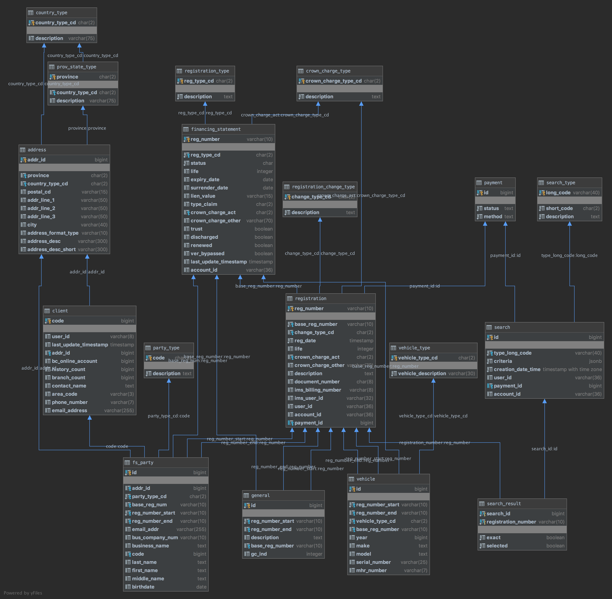

# PPR Data Model

The data model for the next generation PPR system has been completed in concept. The ERD of the target PostgreSQL
implementation is shown here:

## Overview

The intended migration approach for PPR is to use an Oracle database while both the legacy and replacement systems are
active. Both systems would be connected to Oracle during this time. Once the legacy system is terminated, then the
database can be migrated to PostgreSQL (EDB).

Database setup is meant to be handled by Alembic scripts which are executed when a PPR API pod starts up. This ensures
that the database state will always be consistent with the API implementation.

There are a few core concepts in the data model, described in the next sections. 

### Financing Statements

Financing Statements have a hierarchical structure rooted in the `financing_statement` table. There are 2 ways to access
a financing statement: Current state quick lookup and historical event based rebuild.

At the core, updates to financing statements need to be able to reflect the state at a particular time, so it is
important that any changes be non-destructive.  This is why some data may appear to be duplicated, so it is correct in
both contexts.

#### Event Based Data Lookup

Modifiable data that exists at the root of a financing statement is stored in the `registration` table. Within the API
and project vocabulary, a `registration` record is interchangeable with the term "**Event**". In the case of `life`, if the
event is for a renewal, then the length of the renewal (or `-1` if infinite) is stored. Events that don't affect life
would have a `null` value in `life`.

For entities that are related to financing statements (Parties and Collateral), each table will have 2 foreign keys to
`registration`: a starting event reference and an ending event reference. Changes to these tables would be handled by
"start/end pairs" rather than editing the data.

For example, if an end user corrected a typo in an address for a financing statement, rather than modify the address a
new `registration` event should be created.  This would do the following:
- Insert a new `registration` associated to the `financing_statement`
- Update the `fs_party.reg_number_end` of the row that belongs to the financing statement and owns the affected address.
- Insert a new `fs_party` record as well as an associated `address`, setting `fs_party.reg_number_start` to the value of
  `registration.reg_number`

#### Current State

For a quick lookup, you should be able to get the current state of a financing statement without processing each
individual event. Core financing statement values should be stored on the `financing_statement` table. In the case of
`life`, the value stored should be the same as the cumulative values for all of the associated `registration` rows, or
`-1` (infinite) if any of the events have that value.

Some fields on `financing_statement` are readonly, in that they can only be set when the Financing Statement is created
and cannot be amended or changed at a later time. These do not need a corresponding field on `registration`. Some
examples: `trust`, `surrender_date`, `lien_value`.

In order to lookup records in the relational tables, simply filter out records that have an ending event.  For example,
to get the `fs_party` records that are currently active, query by the `financing_statement.reg_number` value where
`reg_number_end` is `null`.

### Search

Search data is stored in the database so it can be retrieved at a later date.  Most of the data is meant to be readonly
once the search is created, but provides details about what searches were performed, by whom and what records were
found.

Search results are stored in `search_result` with a foreign key to `registration.reg_number`.  The value stored should
be for the **most recent** `registration` for a matching financing statement _**at the time the search was executed**_.
This is so that the financing statement can use an event based approach to repeatedly rebuild the state at that time.

### Party Codes

The legacy system has a concept of Party Codes, which are reusable codes that can be entered to pre-fill details for a
party. In the new system, this is captured in the `client` table.

### Payments

The `payment` table is simply a minimal amount of data that represents the SBC Payment System. When a payment is created
for a search or new event, then the identifier, status and payment method would be captured here.

## Implementation Status

### Current State

As of April 7, 2020, the alembic scripts are up to date and were used as the basis for the attached ERD. The work on the
project so far has been against PostgreSQL databases, as this was the original target system.  Some work will be needed
to make both the alembic scripts and API model layer compatible with Oracle.

Additionally, during project development, the EDB database (the intended target platform) was not in a functioning
state, so the team temporarily moved to a Patroni database to gain stability.  As a result, the API has data sources
configured for both Patroni and EDB, with the model layer using an intermediate module that proxies to the Patroni
data source.

No Oracle data sources are configured.

### Proposed Migration Path

Another component of migrating from the legacy to replacement system will be migrating the data from the old system.
Because alembic will be used to manage the schema in the long term, is should be used to generate the schema for all
database instances. To get to the state where both systems are running on the Oracle system, follow these steps for each
environment:
- Create a dedicated Oracle schema.
- Deploy the API in OpenShift and allow it to connect to the database. Alembic will run automatically, generating the
  objects in the schema.
- Run a process that migrates the data from IMS into the target database. See Bob Bowles for details.

The steps above should be repeatable so that can be performed as needed in the non-production environments.

### Legacy Fields

- `registration.documentid`: In the legacy system, a unique document id was produced for every `registration` that was
  different than the `registration_number`. This value was used only to lookup a Draft financing statement in order to
  verify it. In the proposed design, there is no more use for a Document ID to be used in this fashion, so it's
  expected that the value will consistently be null for new records.
- `registration.ims_user_id`: This value should only be set for records created in the legacy system, and will be the
  RACF id of the user that performed the operation.
- `registration.ims_billing_number`: This value should only be set for records created in the legacy system, and will be
  a reference number for the billing record in BC Online.
